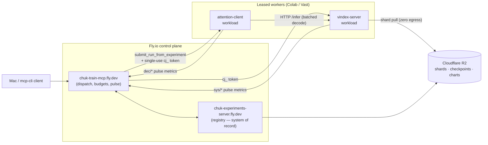
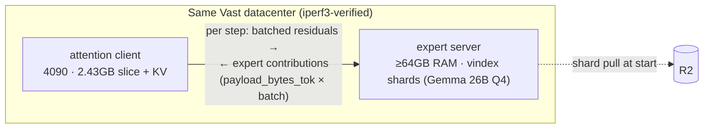
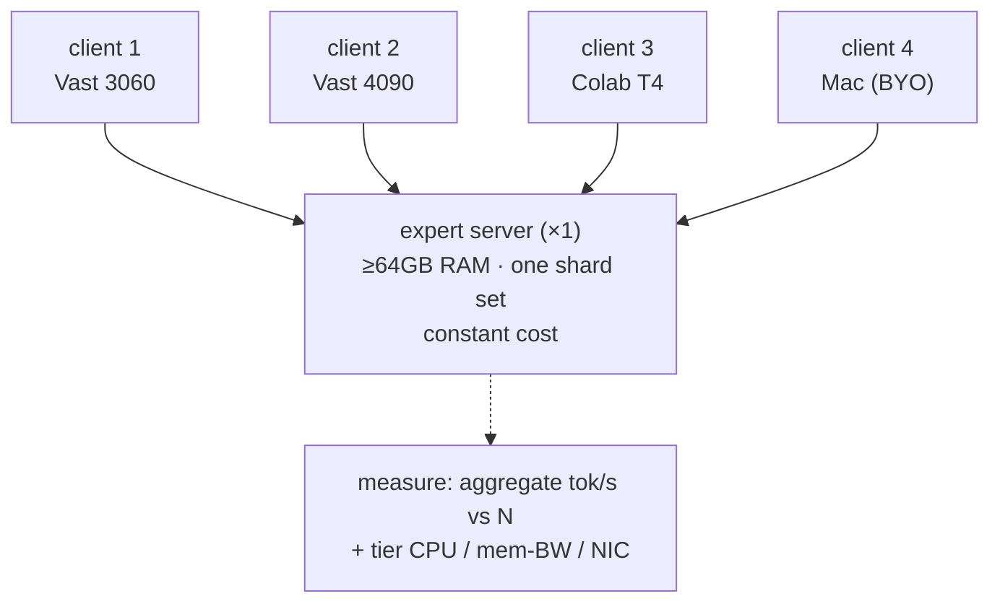
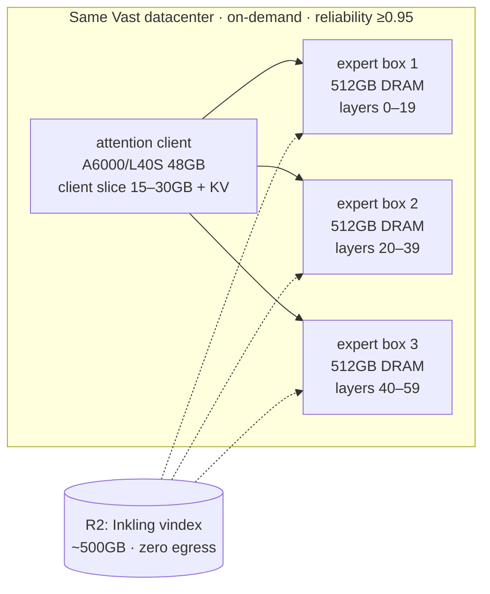

# DEC Funnel v0.2 — Decoupled-FFN Serving at Batch and at Frontier Scale

> **Archived reference.** Superseded by `dec-funnel.md` (v0.4.1). Kept because the current funnel inherits this document's control plane (§4.1), procurement filters (§4.3), iperf3 network-verification gate (§4.4), and budget rate basis (§7) by reference.

**Programme:** DEC-0 … DEC-5 (pre-registered)
**Estate:** chuk-mcp-training (rig) · chuk-experiments-server (registry, system of record) · Cloudflare R2 (artifacts/shards) · LARQL vindex (serving stack)
**Status:** draft v0.2 — gates and kill criteria pre-registered before any run executes; infra spec + topologies added
**Date:** 2026-07-22

---

## 1. Objective

Convert the single-stream decoupled-inference result (Gemma 4 26B A4B: attention local, experts served remotely over HTTP via vindex, ~25 tok/s LAN) into **measured curves at batch and at frontier scale**, sufficient to support two claims:

1. **Fleet claim** — a decoupled Granite/Inkling-class serving fleet costs O(commodity GPUs + DRAM), not O(Hopper nodes), because the knowledge tier is a shared service scaling with aggregate token throughput rather than replica count.
2. **Public claim (video)** — Inkling (975B / 41B active, Apache 2.0) runs live on ~$2–3/hr of rented hardware with all expert weights resident in CPU DRAM.

Everything below is **pure inference — exact function, relocated weights.** No approximation, no store-fidelity dependency, no E4. The walk/sparse-fidelity research track is explicitly out of scope for DEC.

## 2. Claims under test

| ID | Claim | Falsifier |
|----|-------|-----------|
| C1 | vindex serving compute survives batched decode (gate lookup + expert stream at batch 64 within the per-step budget) | step time grows super-linearly with batch on loopback |
| C2 | transport survives batch: payload × batch × steps fits a real NIC; latency amortises to one round trip per step | throughput at batch 32+ NIC-bound below useful tok/s on LAN-class links |
| C3 | one expert tier serves N attention clients with near-linear aggregate throughput (shared knowledge tier) | aggregate tok/s flattens before N=4 while tier CPU/NIC has headroom |
| C4 | DRAM streaming amortises for ultra-sparse MoE only up to a batch-union bound (honest limit, measured) | n/a — metrology; deliverable is the curve itself |
| C5 | Inkling runs end-to-end decoupled: attention on one ≤48GB card, experts on 2–3 DRAM boxes, ≥5 tok/s single-stream | fails to produce coherent output, or <1 tok/s sustained |

Gate rule: **C1 → C2 → C3 are sequential gates.** C4 runs any time (independent). C5 (Inkling) does not start until C1 and C2 pass on Gemma 26B — extractor bugs must be distinguishable from architecture failures.

## 3. Experiment ladder

### DEC-0 — Loopback batch curve (Gemma 26B, Colab, ~£0)

*Tests C1. No network.*

- **Infra:** one Colab high-RAM instance. Attention client (2.43GB slice) on T4; vindex server on same VM, CPU, experts ~14GB Q4 in RAM; localhost transport.
- **Method:** synthetic decode load, batch ∈ {1, 8, 16, 32, 64}; fixed prompt set from the registry; 3 repeats per point, fixed seeds.
- **Metrics (pulse channel):** `dec/tok_s`, `dec/step_ms_p50`, `dec/step_ms_p99`, `dec/ffn_ms_per_layer`, `sys/cpu_util`, `sys/mem_bw_est`, `dec/gate_lookups_s`.
- **Pass:** step time sub-linear in batch through 32; tok/s at batch 32 ≥ 8× batch-1 tok/s.
- **Kill:** serving compute saturates below batch 16 → the shared-tier economics fail regardless of transport; stop and profile before any spend.
- **Deliverable:** Chart 1 — tok/s and step-time vs batch, loopback.

### DEC-1 — Split-tier batch curve (Colab/Vast, ~$3)

*Tests C2. Doubles as rig proving run E2 (live Vast).*

- **Infra:** arm A — attention on Colab T4, vindex server on Vast high-RAM CPU box (WAN, latency-hostile, cheap). Arm B — attention on Vast 3060/4090 + vindex server on Vast CPU box, same datacenter (LAN-class; the number that matters).
- **Method:** same batch sweep as DEC-0. Record per-token payload bytes explicitly (compressed and uncompressed) — resolves whether the 660KB/token from the 26B demo is irreducible.
- **Metrics:** DEC-0 set + `dec/payload_bytes_tok`, `dec/rtt_ms`, `sys/nic_mbps` (both sides).
- **Pass:** arm B batch-32 throughput ≥ 70% of DEC-0 loopback at same batch; payload × batch × steps ≤ 60% of measured NIC capacity.
- **Kill:** LAN-class arm is NIC-bound below batch 16 with no payload-compression path identified.
- **Budget hard wall:** 4 GPU-hours + 6 CPU-box-hours; workers auto-destroyed at wall per rig policy.
- **Deliverable:** Chart 2 — batch curve loopback vs LAN vs WAN, with NIC utilisation overlay.

### DEC-2 — Shared tier (Vast multi-worker, ~$5)

*Tests C3. The fleet-economics chart.*

- **Infra:** one vindex expert server (Vast CPU box); N attention clients for N ∈ {1, 2, 3, 4}: mix of cheap Vast GPUs, the Colab session, and the Mac as BYO/persistent worker (long-lived token class; never destroyed by control plane).
- **Method:** each client runs the DEC-1 arm-B workload at fixed batch (choose the knee from DEC-1, likely 16–32). Measure per-client and aggregate throughput as N grows; expert-server CPU, memory bandwidth, NIC alongside.
- **Pass:** aggregate tok/s at N=4 ≥ 3.2× N=1 (≥80% linear) with tier headroom visible.
- **Kill:** flattening caused by tier compute/NIC saturation at N≤2 → per-replica duplication assumption survives; fleet claim reverts to single-box KTransformers-class only.
- **Deliverable:** Chart 3 — aggregate tok/s vs client count, tier utilisation overlay. This is the slide.

### DEC-3 — Sparse batch-union metrology (Vast, ~$2, independent)

*Tests C4. Synthetic; no real weights.*

- **Infra:** one big-RAM Vast EPYC box.
- **Method:** allocate synthetic expert tensors; per token per layer sample top-16-of-896 under (a) uniform and (b) skewed (Zipf) routing; stream the batch-union per step; measure step time vs batch ∈ {1 … 256}. Repeat at top-6-of-~256-class config (Inkling-shaped) and top-8-of-128 (Gemma-shaped).
- **Deliverable:** Chart 4 — effective GB streamed per step and step time vs batch, per sparsity config. Defines where DRAM amortisation dies for K3-class models; quoted as the honest boundary in both the video and the internal pitch.

### DEC-4 — Inkling extraction (Vast, ~$5–10)

*Prereq for C5. Gate: DEC-0 and DEC-1 passed.*

- **Infra:** one Vast box with ≥2TB NVMe and fat downlink.
- **Method:** pull Inkling weights from HF; parse architecture from config + tml-renderer reference; drop multimodal weights (text path only, v1); quantise experts to Q4/MXFP-class; cut vindex shards by layer range; extract client slice (attention/router/embeddings/norms — measure its actual size, est. 15–30GB, decides DEC-5 GPU class); push shards to R2.
- **Verification before any serving:** logit-match a short prompt set against a reference implementation of the same quantisation, token-level agreement threshold set before the run.
- **Kill:** architecture quirks (controllable-thinking tokens, from-scratch layout) exceed a time-boxed effort wall → park, publish Gemma-scale results, revisit.
- **Artifacts:** Inkling vindex shard set in R2 (zero-egress; reusable asset independent of the video), extractor crate, verification report in registry.

### DEC-5 — Inkling live demo + hero video (~$10–15 total runtime)

*Tests C5.*

- **Infra:** attention client on one Vast 48GB card (A6000/L40S class, ~$0.50–0.80/hr); expert tier on 2–3 Vast EPYC boxes (256–512GB DRAM each), same datacenter; shards pulled from R2 (free egress). Total topology ~$2–3/hr.
- **Method:** single-stream live inference; then re-run the DEC-1/DEC-2 sweeps at Inkling scale as far as budget allows (even N=2 shared-tier at 975B is a headline).
- **Pass:** ≥5 tok/s sustained single-stream, coherent output; stretch: ≥10 tok/s.
- **Deliverable:** the frame — split terminal: `nvidia-smi` (one modest card) · `htop` on expert boxes (~500GB resident) · live streaming answer. Plus Charts 1–4 as the "yes it scales" companion material.

## 4. Infrastructure specification & topology

### 4.1 Control plane (all stages)

Unchanged from the current estate — DEC adds workloads, not infrastructure:

Budget hard-walls, single-use join tokens for leased workers, Mac as BYO/persistent class only — all per existing rig policy. The vindex server carries its existing auth + TLS; join token doubles as the client credential for the demo runs.

### 4.2 Per-stage instance specification

| Stage | Node role | Count | GPU | RAM | Disk | NIC (min) | Rental class |
|---|---|---|---|---|---|---|---|
| DEC-0 | combined (loopback) | 1 | Colab T4 16GB | high-RAM (~50GB) | default | n/a | Colab (paid) |
| DEC-1a | attention client | 1 | Colab T4 | std | default | n/a | Colab |
| DEC-1a | expert server (WAN) | 1 | cheapest attached | ≥64GB | 50GB | 1Gbps | interruptible |
| DEC-1b | attention client (LAN) | 1 | 4090 24GB | ≥32GB | 50GB | 10Gbps pref | interruptible |
| DEC-1b | expert server (LAN) | 1 | cheapest attached | ≥64GB | 50GB | 10Gbps pref | interruptible |
| DEC-2 | expert server | 1 | cheapest attached | ≥64GB | 50GB | 10Gbps | on-demand |
| DEC-2 | attention clients | 4 | 3060/4090 mix (+Mac BYO, +Colab) | ≥16GB | 30GB | 1Gbps | interruptible |
| DEC-3 | metrology box | 1 | cheapest attached | ≥384GB (512 pref) | 50GB | n/a | interruptible |
| DEC-4 | extraction box | 1 | any ≥24GB (dequant/verify) | ≥128GB | **≥2.5TB NVMe** | fat downlink, **unmetered** | on-demand |
| DEC-5 | attention client | 1 | A6000/L40S 48GB | ≥64GB | 100GB | 10Gbps | on-demand, reliability ≥0.95 |
| DEC-5 | expert tier | 2–3 | cheapest attached | 256–512GB each | 250GB each | 10Gbps | on-demand, reliability ≥0.95 |

Vast has no pure-CPU rentals: "expert server" and "metrology box" mean *filter by RAM/cores, sort by price, ignore the attached card* (it can idle, or handle dequant scratch).

### 4.3 Procurement filters (Vast)

- **Reliability:** ≥0.90 for sweeps, ≥0.95 for DEC-4/DEC-5.
- **Placement:** DEC-1b/2/5 require LAN-class inter-node paths — filter by geolocation; strongly prefer a single host exposing multiple rentable slots (same physical machine). Never assume; verify (§4.4).
- **Bandwidth metering:** DEC-4 host must be unmetered or high-included-transfer — a metered 2TB HF pull can exceed the compute cost.
- **Interruptible vs on-demand:** interruptible for restartable sweeps (DEC-1/2 arms, DEC-3); on-demand wherever eviction is expensive in hours (DEC-4 download, DEC-5 filming).

### 4.4 Network verification gate (mandatory pre-benchmark)

Before any claim-bearing run on a multi-node topology:

1. `iperf3` between every attention-client ↔ expert-server pair; record Gbps + RTT.
2. Thresholds: DEC-1b/DEC-2 ≥ 2Gbps and ≤ 2ms RTT to count as LAN-class; DEC-5 ≥ 5Gbps aggregate into the expert tier.
3. Measured values written to the registry run record as metadata (`net/gbps`, `net/rtt_ms`) — a curve without its link measurement is not admissible as a result.

Failing the gate = re-provision, not re-interpret.

### 4.5 Stage topologies

**DEC-1b — split tier, LAN-class (the claim-bearing arm):**

**DEC-2 — shared knowledge tier:**

**DEC-5 — Inkling live demo:**

Shard-by-layer-range mirrors the Gemma/Fly.io demo; exact split set after DEC-4 measures the true client-slice and per-layer expert sizes.

## 5. New build (only these)

1. **Workload packaging:** `vindex-server` and `attention-client` as rig workload units — agent-launchable, join-token in, pulse metrics out, R2 shard pull on start, clean shutdown at budget wall. (Benchmark workload type already on rig roadmap.)
2. **Loadgen:** batched-decode driver with fixed prompt sets + seeds, emitting the `dec/*` metric schema. wrk-class HTTP loadgen against the infer endpoint as a secondary check.
3. **Inkling extractor:** new-architecture safetensors → vindex cutter (DEC-4). The only genuinely novel code in the programme.

## 6. Registry & artifact conventions

- One registry experiment per DEC stage: `dec0-loopback-gemma26b`, `dec1-splittier`, `dec2-sharedtier`, `dec3-sparseunion`, `dec4-inkling-extract`, `dec5-inkling-live`; dispatched via `submit_run_from_experiment`.
- Experiments server is system of record for results, lineage, and shard pins; harness mirrors per the artifact-ownership ruling.
- Charts 1–4 + verification report stored as registry artifacts; shard sets pinned in R2.
- All runs carry budget hard walls; leased workers single-use tokens; Mac only ever BYO class.

## 7. Budget (Vast marketplace rates, Jul 2026)

Reference rates: 4090 ~$0.29–0.39/hr on-demand (interruptible from ~$0.14); 3060-class <$0.12/hr; L40S from ~$0.39/hr; A6000 48GB ~$0.40–0.60/hr; high-RAM hosts ~$0.25–0.50/hr depending on attached card. Marketplace prices float — treat as ±30%.

| Stage | Topology | ~Rate (all-in) | Hours | Est. spend |
|-------|----------|----------------|-------|-----------|
| DEC-0 | Colab only | — | — | £0 (already paid) |
| DEC-1 | 4090 + RAM box same-DC, + WAN arm | ~$0.60/hr | 4–6 | $3–4 |
| DEC-2 | 1 expert box + 4 clients | ~$0.90/hr | 4 | $4–5 |
| DEC-3 | 1× EPYC 512GB host | ~$0.35/hr | 4 | $2 |
| DEC-4 | 2.5TB-NVMe box, unmetered | ~$0.50–0.80/hr | 6–10 | $5–8 |
| DEC-5 | 48GB card + 3× 512GB boxes | ~$2–2.50/hr | 5–8 | $12–18 |
| **Total** | | | | **≈ $26–37** one-off |

Recurring: R2 shard storage ~$7–8/month for the ~500GB Inkling vindex (zero egress on every rerun). Largest cost risk is not compute: it is re-running DEC-4 on an extractor bug — mitigated by the logit-match verification gate before DEC-5 provisions.

## 8. Risks (pre-registered)

- **Extractor is real work** — Inkling is a from-scratch architecture; time-box it (DEC-4 kill wall).
- **Released precision may be BF16** (~2TB download) — budget NVMe and hours accordingly; quantise at extraction.
- **Payload at Inkling scale** — per-token activation payload scales with hidden dim; if DEC-1 shows the Gemma payload is mostly irreducible, DEC-5 needs same-rack placement and possibly host-local sharding; decision point at DEC-1 exit.
- **Colab↔Vast is WAN** — arm A is expected to look like the Fly.io result at batch 1; arm B is the claim-bearing arm. Do not let arm A numbers leak into the headline.
- **Batch-union limit (C4)** — quote it proactively; the credibility of the 20× fleet claim depends on stating where it doesn't hold (K3-class ultra-sparse at high batch).

- **Marketplace networking** — inter-host bandwidth on Vast varies wildly; every multi-node result is gated on the §4.4 iperf3 record, and a run that fails the gate is re-provisioned, never re-interpreted.

## 9. Sequencing

DEC-0 tonight-sized (nothing required beyond current estate + workload packaging). DEC-1/DEC-2 same week once packaging exists. DEC-3 any idle evening. DEC-4/DEC-5 gated, targeted while Inkling is still news.
