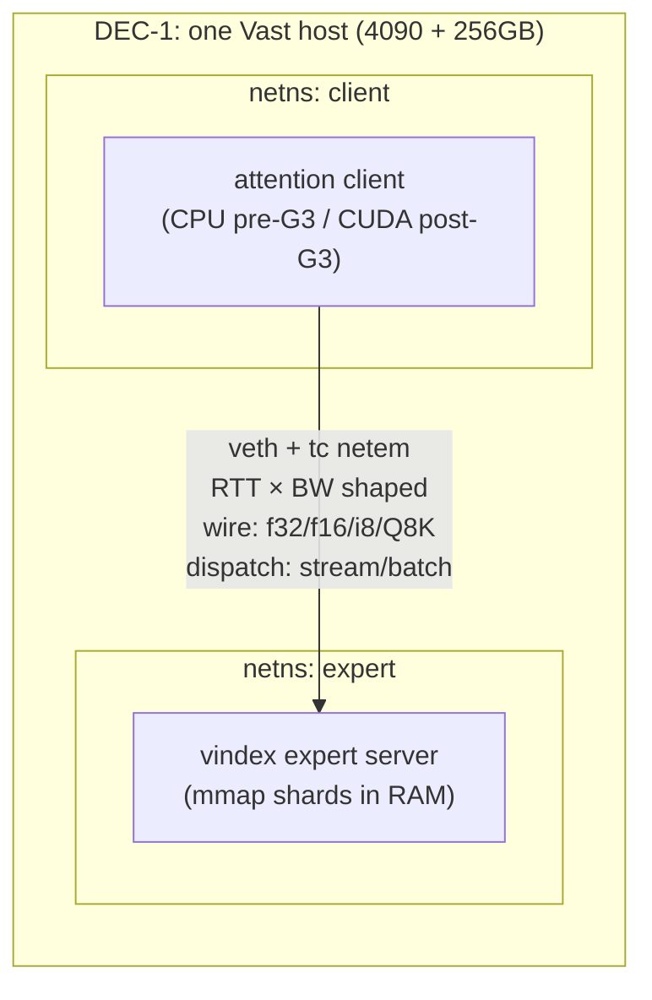
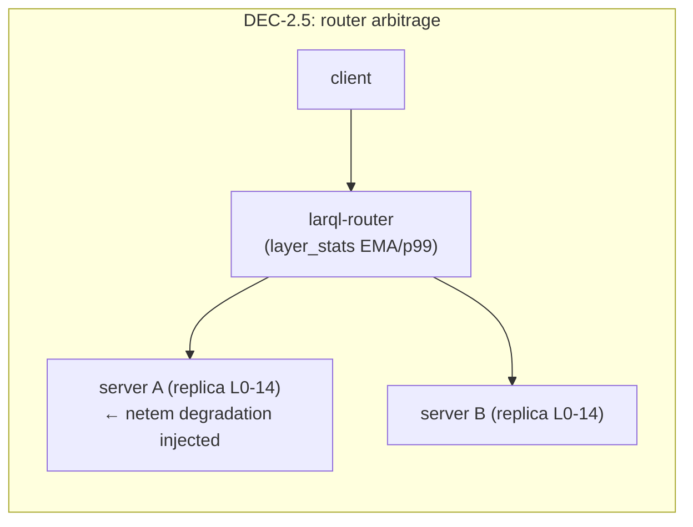

# DEC Funnel v0.4.1 — Decoupled Attention/Weights Serving at Batch and at Frontier Scale

**Programme:** DEC-0 … DEC-7 + G-ladder (GPU engineering) + C-ladder (CPU kernels)
**Estate:** larql (grid stack, wire codecs, router, bench infra) · chuk-mcp-training (rig, `gpu-training-harness` repo) · chuk-experiments-server (registry) · Cloudflare R2 (shards) · Vast/Colab (compute)
**Status:** v0.4.3 — **DEC-0 arm M executed 2026-07-23: C1 passes on the dense/shared-expert path** (see the Result note in §3 DEC-0; registry `dec0-loopback-mac`); routed-experts arm + arm L pending. Codebase DEC-prep landed 2026-07-22 (module splits, `FormatRoute` quant registry, backend factory — hardening items 7+9). Instruments built: DEC-0/DEC-1's batch axis is measured by the `larql dec-bench` residual-replay loadgen (capture + replay, `dec/*` pulse emission, movement-ratio accounting via the `/v1/stats` `ffn_weights` extension); e2e tok/s stays single-stream via `larql bench --ffn`; client batched decode explicitly deferred. v0.4.1 made the spec repo-resident: v0.2 archived alongside as [`dec-funnel-v0.2.md`](dec-funnel-v0.2.md) with carry-overs resolved; K3 registry slugs added; DEC-0 anchor configuration pinned. v0.4 added the Kimi K3 track (DEC-6/7): KDA client port, MXFP4 expert path, batch-union positioning; DEC-3 upgraded to re-parameterise on K3's real routing statistics.
**Date:** 2026-07-22

---

## 1. Thesis & objective

The claim under test is **not** host offload for MoE. It is the decoupling of the transformer along its stateful/stateless boundary:

- **Attention** is the stateful half — KV/continuation state, per-user session, sequence position, latency budget. It stays GPU-side and sizes the GPU fleet.
- **The FFN/expert contribution** is a stateless pure function of the residual. Stateless pure functions become shared, durable, horizontally-scaled service tiers — with sharing, replication, versioning, hot-swap, and independent scaling inherited from the cut, not bolted on.

Direction of movement is the category difference: offload moves **weights to the compute** (GB across PCIe, one box, no sharing); this architecture moves **compute to the weights** (KB of activations across a negotiated wire, N clients, durable tier).

Consequently the interconnect is not a deployment constraint to survive — it is **the resource the architecture schedules**, and larql already engineers it three layers deep: wire codec ladder (f32/f16/i8/Q8K, per-request negotiated), dispatch batching (streaming 0.6 → batch 6.5 tok/s on 31B dense remote-FFN), and latency-EMA/p99 per-layer routing (`HeartbeatMsg.layer_stats` → larql-router steers replicated layers to the fastest server).

**DEC's job:** characterise the scheduler's operating envelope — the feasible region in (RTT × bandwidth × batch × wire format × dispatch mode) — and demonstrate the two artifacts no offload or AFD lineage can produce: a **shared multi-client knowledge tier** and **adaptive routing under degraded links**; then land both at frontier scale on Inkling.

Everything is pure inference — exact function, relocated weights. The walk/sparse-fidelity research track (E4) is out of scope.

### Cross-cutting metric: movement ratio

`dec/movement_ratio` = bytes crossing the attention↔weights boundary per token ÷ expert/FFN weight bytes touched per token. Offload ≈ 1.0 by construction; this architecture targets 10⁻³–10⁻⁴. Reported on every run; it is the one number that makes the categorical difference legible.

## 2. Claims under test

| ID | Claim | Falsifier |
|----|-------|-----------|
| C1 | Serving compute survives batched decode (gate/expert path at batch 64 within step budget) | step time super-linear in batch on loopback |
| C2 | The feasible region is large: at batch ≥16 with batch dispatch + f16 wire, LAN-class links (≤2ms, ≥2Gbps) reach ≥70% of loopback throughput | region collapses to loopback-only |
| C3 | One expert tier serves N clients near-linearly (≥80% linear at N=4) with tier headroom | saturation at N≤2 from tier compute/NIC |
| C4 | DRAM streaming amortisation for ultra-sparse MoE has a measurable batch-union bound (metrology; deliverable is the curve) | n/a |
| C5 | Inkling runs end-to-end decoupled: ≤48GB-VRAM attention client, experts in DRAM, ≥5 tok/s single-stream, shannon-verified | incoherent output or <1 tok/s |
| C6 | Wire codec ladder trades bandwidth for bounded fidelity: i8/Q8K paths stay within a pre-set bits/char drift vs f32 wire | drift exceeds gate on standard corpus |
| C7 | The latency-EMA router arbitrages heterogeneous links: traffic migrates off a degraded replica within a bounded window and recovers ≥90% of pre-degradation throughput | router fails to migrate or oscillates |
| C8 | K3 (2.8T, 16/896, MXFP4, KDA) runs decoupled as a **capability tier**: ≥3 tok/s single-stream from DRAM-resident experts, shannon-verified, with its batch ceiling pre-predicted by the DEC-3 boundary chart | incoherent output, <1 tok/s, or measured ceiling contradicting the DEC-3 prediction by >2× (instrument failure) |

Gate order: C1 → C2 → C3 sequential; C6 measured inside DEC-1; C7 = DEC-2.5 after C3; C4 independent; C5 gated on C1+C2 **and** G3 (CUDA correctness); C8 gated on C5 (Inkling proven first) + DEC-3 re-parameterised on K3's real routing statistics.

## 3. Experiment ladder

### DEC-0 — Loopback batch curve, dual-arm (£0)

*Tests C1.*

- **Arm M (reference):** M3 Max, Metal attention + local expert server over loopback — anchors against known numbers (26B A4B: local 18.9 / 1-shard grid 18.3 / 2-shard 17.3 tok/s; `LARQL_SKIP_MOE=1` ceiling 56.8 — canonical name as of 2026-07-22; the unprefixed `SKIP_MOE` the grid path historically read is now a loud deprecated alias, hardening item 9). **Anchor configuration note:** those numbers predate the KV append-in-place and spin-pool landings (CPU-path 26B is now 27.9 tok/s short-ctx flags-off, ~34.9 with `LARQL_SPIN_POOL=1`); DEC-0 re-baselines with the flag set recorded in the run record, and a first-run result *above* the anchor is expected, not an instrument error. Regression-checking is against the re-baseline, not the historical anchor.
- **Arm L (Linux):** Colab high-RAM — T4 present but attention on **CPU until G-ladder lands**; expert server on same VM. Absolute tok/s is non-hero; the batch *shape* (sub-linearity of step time) is the claim-bearing measurement.
- **Method — two instruments, pre-registered (v0.4.2):** larql's decode loop is single-sequence (`--ffn-dispatch batch` batches *layer dispatches* within one token step, not sequences), so the batch axis is measured by the **residual-replay loadgen** (`larql dec-bench`): capture real pre-normed per-layer residuals from single-stream decode over 64 distinct prompts (`dec-bench capture`, prompts pinned in `bench/dec0/prompts.txt`), then replay them as B-row `/v1/walk-ffn[-q8k]` requests (`dec-bench replay`), batch ∈ {1, 8, 16, 32, 64} × wire {f32, f16, i8, q8k} × dispatch {streaming, batch}, 3 repeats. Distinct prompts per row keep the MoE routing union realistic; replay frames send `top_k=0` (defuses the server's L2 FFN cache); replay is model-free, so a Mac-captured pool runs unchanged on the x86 arms. E2e tok/s remains the **single-stream anchor** via the existing `larql bench --ffn` path. C1's step-time-vs-batch claim is about the expert tier, which the loadgen measures directly; client-side batched decode is NOT built — revisit at DEC-2 if aggregate-throughput claims need it. Scope note: `/v1/walk-ffn` exercises the dense/shared-expert FFN path; a routed-experts replay arm (`/v1/expert/*`) is a pre-registered fast-follow **required before declaring C1 pass on the 26B MoE layers**. Driver: `scripts/dec0-loopback.sh`.
- **Metrics:** `dec/tok_s`, `dec/step_ms_p50/p99`, per-layer stats from `HeartbeatMsg.layer_stats`, `dec/movement_ratio`, `sys/*`.
- **Pass:** step time sub-linear through batch 32 on both arms.
- **Kill:** serving compute saturates below batch 16 → profile before any spend.
- **Result — arm M ran 2026-07-23 (registry `dec0-loopback-mac` / `RUN-20260722-231112-00437`, commit `021ab42f`): C1 PASSES on the dense/shared-expert path.** Batch-dispatch step p50 ×1.6–1.8 at B32 vs B1 (f32/f16/i8; B8 free at ×0.9–1.0, B16→B32 nearly flat); q8k B1 = 12.5 ms (fastest single-row arm) converging to the same absolute batch step times via the §1a batched-GEMM fix. Movement ratio measured 1.2–1.9 × 10⁻³ across wires. Aggregate tier throughput ~1,050 tok/s at B64/batch (~25× single-stream); streaming dispatch reaches only ×5.1–5.7 at B64 — the dispatch axis is load-bearing. Anchor re-baseline: remote-FFN streaming 27.8–28.6 tok/s (vs historical 18.3), warm local Metal MoE 23.6, split ~66% attention / 34% FFN round-trips; i8 genuinely served (`LARQL_I8_WIRE=1`, 285 KB/tok). Kill condition not approached. The 64-prompt residual pool is captured and host-portable (`bench/dec0/residuals-gemma4-26b-a4b-q4k`, local + registry artifacts 701/702) — arm L and DEC-1 replay from this exact pool.
- **Result — routed-experts arm ran 2026-07-23 (`RUN-20260723-223428-00439`, commit `64c9e0e0`): C1 COMPLETE on the full 26B.** Real captured routing replayed against `/v1/experts/multi-layer-batch[-q8k]`: step p50 ×23.6 at B32 (sub-linear; kill condition clear), tier ~178 tok/s flat from B16. Honest mechanism split is load-bearing: dense amortises by GEMM weight-sharing (×1.6), routed only by thread-fill + overhead (server streams experts per-row — pre-registered perf caveat), so the routed ceiling is a schedule property. **Batch-union bound measured from production routing: unique-expert bytes = 13.9% of naive at B64 (~7.2× grouped-scheduler headroom — more overlap than uniform-random predicts)**, upgrading DEC-3's curve with a real-routing point ahead of schedule; build the expert-grouped scheduler before quoting DEC-2 tier-capacity numbers. Movement ratio 5.2–8.2 × 10⁻⁴ routed. DEC-0 arm M is CLOSED in the registry (`dec0-loopback-mac` completed).

### DEC-0.5 — x86 expert-tier kernel gate (~$1)

The hot CPU path (Q4K inner dot) is hand-written **aarch64 NEON**, tuned on M3 Max; Linux/x86 falls back to the generic/OpenBLAS route. Before any fleet-wide projection:

- **Method:** identical expert-server bench (per-layer expert/FFN latency, gate KNN, dequant-stream throughput) on the Mac vs one cheap Vast x86 EPYC box.
- **Gate:** x86 within 2× of Apple Silicon per-core → proceed, note the factor in all projections. Worse than 3× → **C-ladder (AVX-512/AMX Q4K inner dot) becomes a blocker for the fleet claim** (not for the demo — the demo can eat the factor) and gets scheduled before DEC-5's throughput arm.
- Rationale: every DEC-2/3/5 curve runs on x86 DRAM boxes; projecting from M3 numbers without this factor is the most likely way the 20× claim quietly becomes 6×.

### DEC-1 — The feasibility surface (netem, single box, ~$2–3)

*Tests C2 + C6. Replaces v0.2's two-arm design.*

- **Infra:** one Vast host, 4090 + ≥256GB RAM. Attention client and expert server in separate network namespaces; `tc netem` shapes the veth.
- **Sweep:** RTT ∈ {0.05, 0.2, 1, 5, 20ms} × bandwidth ∈ {1, 2.5, 10, 25, ∞ Gbps} × batch ∈ {1, 8, 16, 32, 64} × **wire ∈ {f32, f16, i8, Q8K}** × **dispatch ∈ {streaming, batch}**. Prune with a coarse pass, densify around the knee.
- **Instrument:** the DEC-0 pair — `larql dec-bench replay` for the batch×wire surface (same Mac-captured pool; replay is model-free) + `larql bench --ffn URL` for the single-stream anchor + `make bench-wire` for codec throughput — run as a rig workload emitting the `dec/*` schema. Record `dec/payload_bytes_tok` per wire format.
- **Model check:** the surface must reproduce the two known field points — ~25 tok/s LAN and 2–3 tok/s Fly.io London on 26B (30 crossings × RTT accounting). If it doesn't, the instrument is wrong, not the field data.
- **C6 gate:** i8/Q8K arms run `larql shannon verify`-style bits/char scoring vs the f32-wire baseline; drift gate pre-set at 0.5% (matching the repo's existing CI threshold).
- **Pass (C2):** as stated in claims table.
- **Deliverable:** Chart 2 — the feasibility map: for each (RTT, BW), max tok/s over wire×dispatch at batch 32, annotated with the colocation classes (loopback / rack / DC / metro) each configuration can inhabit. This is the central chart of the programme.

### DEC-2 — Shared knowledge tier (~$5)

*Tests C3. Unchanged pass criterion; upgraded framing: this is the experiment structurally impossible for offload — it has no N-client story at any price.*

- One expert server; N ∈ {1,2,3,4} attention clients (cheap Vast GPUs — CPU attention acceptable pre-G-ladder — + Colab + Mac BYO). Fixed batch at the DEC-1 knee. Aggregate tok/s vs N; tier CPU/mem-BW/NIC overlay; `dec/movement_ratio` per client.
- **Pass:** ≥80% linear at N=4 with tier headroom. **Kill:** saturation at N≤2.
- **Deliverable:** Chart 3 — the category chart.

### DEC-2.5 — Router arbitrage under degradation (~$2)

*Tests C7. The adaptive-grid demonstration; no offload/AFD lineage can draw this chart.*

- **Infra:** one client; a layer range replicated across two expert servers behind larql-router.
- **Method:** steady state at fixed batch → netem-degrade server A (inject 10ms RTT, then throttle bandwidth) → observe `layer_stats` EMA/p99 and route-share migration → remove degradation → observe recovery. Repeat with degradation flapping to probe oscillation.
- **Pass:** ≥90% of pre-degradation throughput recovered within a bounded migration window; no sustained oscillation under flap.
- **Deliverable:** Chart 4 — route share + tok/s over time with degradation window shaded. Also the strongest 30 seconds of video B-roll in the programme.

### DEC-3 — Sparse batch-union metrology (~$2–4, independent, two passes)

*Tests C4 and pre-draws C8's ceiling.*

- **Pass 1 (synthetic, any time):** synthetic experts on a big-RAM x86 box; top-16-of-896 (K3-shaped), top-6 (Inkling-shaped), top-8-of-128 (Gemma-shaped) under uniform and Zipf routing; effective GB/step and step time vs batch ∈ {1…256}.
- **Pass 2 (K3-real, at weight drop):** re-parameterise with K3's **actual expert-selection distribution** — harvested from the published config + a routing-statistics run over a standard corpus as soon as weights land (2026-07-27 promised), even if DEC-6 itself waits. Upgrades the boundary chart from estimate to prediction; DEC-7's measured ceiling must land within 2× of it (C8's instrument-check clause).
- **Deliverable:** Chart 5 — where DRAM amortisation dies per sparsity class, synthetic and K3-real overlaid; quoted proactively as the honest boundary of the claim.

### DEC-4 — Inkling extraction (~$5–10; gate: DEC-0 + DEC-1 passed)

- 2.5TB-NVMe unmetered Vast box; `larql extract` extended with the Inkling architecture (tml-renderer + config as reference); drop multimodal weights (text-only v1); Q4K experts; `larql slice --preset client` / `expert-server`; `larql publish` → R2 mirror.
- **Verification gate:** `larql shannon verify` against the HF reference on a fixed corpus, ≤0.5% bits/char — the repo's existing cross-engine harness is the logit-match gate, no new verifier needed.
- **Kill:** time-boxed effort wall on architecture quirks → park, ship Gemma-scale results, revisit.
- **Artifacts:** Inkling vindex (full + client + expert-server slices) in R2 — the reusable asset independent of the video.

### DEC-5 — Inkling live demo (~$8–14; gate: DEC-4 verified **and** G3 passed)

- **Primary arm — single fat host:** one Vast box, 48GB card + 512GB–1TB RAM; experts in host DRAM, zero network. Best tok/s, least filming risk. Expected 5–15 tok/s single-stream (41B active ≈ ~20GB/token Q4 vs 200–400GB/s real-world DRAM BW, minus dequant/orchestration).
- **Secondary arm — networked tier:** 2-box expert split via `--moe-shards`, same DC, for the distributed frame and a small-N shared-tier point at 975B.
- **Pass (C5):** ≥5 tok/s sustained, coherent, shannon-verified extraction. Stretch ≥10.
- **Deliverable:** the frame — `nvidia-smi` (one modest card) · `htop` (hundreds of GB resident) · live stream — plus the movement-ratio line: "~20GB of weights participated in that token; kilobytes moved."

### DEC-6 — K3 extraction + KDA client port (gate: DEC-5 passed; weights published)

The serving topology transfers wholesale from Inkling; what's new is model-side:

- **6a — expert path (moderate, partly solved):** MXFP4 expert extraction reuses the GPT-OSS-120B lineage (128-expert MXFP4 already in the support table); 896 experts is a bigger bank for existing range-sharding. New: MXFP4 dequant-or-native decision on the x86 tier (AMX speaks INT8/BF16 — dequant pass in the streaming loop vs a native FP4 gather kernel; benchmark both, pick per DEC-0.5 methodology).
- **6b — KDA attention client (the real port):** Kimi Delta Attention is hybrid linear attention, not vanilla SDPA — new attention math in the client slice, plus faithful Stable LatentMoE routing (latent-space routing, quantile balancing) for router-side expert selection. This is to K3 what the whole extractor was to Inkling: expect 3–6 weekends. `shannon verify` ≤0.5% bits/char against the reference implementation is the gate, unchanged.
- **Compensating factor to measure:** KDA's design goal is cheap decode state at long context → *lower* KV pressure on the client GPU. K3 is harder on the expert tier and kinder on the attention tier; record client-side KV bytes/token alongside the usual schema.
- **Infra:** extraction box upgraded to ≥3TB NVMe; ~1.4TB native download.
- **Kill:** KDA port exceeds its time-box → park with Inkling shipped; the programme's claims stand without K3.

### DEC-7 — K3 live: the capability-tier demo (gate: DEC-6 verified)

- **Infra:** one or two 1.5–2TB-DRAM hosts (single fat host preferred, per DEC-5 lesson) + the DEC-5 attention client class.
- **Positioning (pre-registered, load-bearing):** K3-decoupled is a **single-digit-batch capability tier** — hard queries, interactive agent sessions — *not* a throughput tier. The batch-union bound from DEC-3 pass 2 is quoted up front; DEC-7 measures against it (C8's 2× instrument clause).
- **Pass:** ≥3 tok/s single-stream sustained, coherent, shannon-verified; measured batch ceiling within 2× of the DEC-3 prediction.
- **Narrative:** the escalation act — largest open model ever (2.8T) on the same architecture, *with its honest limit measured and stated* — the chart that separates a research programme from a stunt.

## 4. G-ladder — GPU engineering (CUDA attention client)

larql's GPU path is Metal-only today ("Vulkan/CUDA later"); on Linux the attention client falls back to CPU. The hero demo and any NVIDIA fleet claim need a CUDA attention path. Scoped as its own gated ladder, off DEC's critical path for everything except DEC-5:

- **G0 — backend decision (time-boxed).** CUDA-native (cudarc/PTX, Metal shaders as the reference implementation, maximum kernel control) vs wgpu/Vulkan (portability, one shader dialect for Metal+Vulkan+CUDA-via-Vulkan, likely perf tax on Q4K inner loops). Default recommendation: CUDA-native for the bounded client-slice kernel set; revisit wgpu when portability matters more than the hero number.
- **G1 — quantised GEMV/GEMM:** Q4K/Q6K matvec + matmul kernels (QKV/O projections, LM head). The MSL shaders (`q4k_matvec`, defused norm+QKV per ADR-016) define the semantics to port.
- **G2 — attention path:** RMSNorm, RoPE, SDPA with KV cache through the `KvEngine` trait, GEGLU (client-side dense layers where present). Client slice only — no expert kernels needed for DEC-5's primary arm.
- **G3 — correctness gate:** `larql shannon verify` on the CUDA path vs HF/PyTorch, ≤0.5% bits/char, wired into the existing shannon-verify CI workflow. **DEC-5 hero is gated on G3**, not on G-ladder completion.
- **G4 (post-DEC-5, optional):** `cuda-experts` — GPU-backed expert servers, mirroring `metal-experts` (with its known build-separation constraint: server binary only).

**Interim validity note:** DEC-0…2.5 curves are claim-bearing with CPU attention — they characterise the expert tier, the wire, and the router, and the crossing-tax accounting is attention-implementation-independent. Only absolute end-to-end tok/s waits on G3, and only DEC-5 headline numbers require it.

## 5. C-ladder — x86 CPU kernels (conditional)

Triggered by DEC-0.5: AVX-512/AMX Q4K inner dot for the x86 expert tier, acceptance = closing to ≤2× Apple Silicon per-core on the expert-server bench. Blocker for fleet-cost projections if DEC-0.5 shows >3×; never a blocker for the demo.

## 6. Infrastructure specification & topology

Control plane unchanged from v0.2 §4.1 (archived alongside this doc as [`dec-funnel-v0.2.md`](dec-funnel-v0.2.md)): Fly control plane (`chuk-train-mcp.fly.dev` dispatch/budgets/pulse + `chuk-experiments-server.fly.dev` registry as system of record) + Cloudflare R2; budget hard-walls; single-use cj_ join tokens for leased workers (token doubles as the vindex client credential); Mac BYO/persistent class only. Workload units: `vindex-server`, `attention-client`, `netem-harness` (namespace + tc setup + sweep driver), each agent-launchable with pulse metrics.

| Stage | Node role | Count | GPU | RAM | Disk | NIC | Rental |
|---|---|---|---|---|---|---|---|
| DEC-0 M | Mac (BYO) | 1 | Metal | 128GB | — | — | — |
| DEC-0 L | Colab combined | 1 | T4 (idle pre-G3) | high-RAM | default | — | Colab |
| DEC-0.5 | x86 bench box | 1 | cheapest attached | ≥128GB | 50GB | — | interruptible |
| DEC-1 | netem host | 1 | 4090 | ≥256GB | 100GB | n/a (namespaces) | interruptible |
| DEC-2 | expert server | 1 | cheapest | ≥64GB | 50GB | 10Gbps | on-demand |
| DEC-2 | clients | 4 | 3060/4090 mix + Mac + Colab | ≥16GB | 30GB | 1Gbps | interruptible |
| DEC-2.5 | router + 2 servers + client | 4 | cheapest | ≥64GB ea | 50GB | 10Gbps | on-demand |
| DEC-3 | metrology box | 1 | cheapest | ≥384GB | 50GB | — | interruptible |
| DEC-4 | extraction box | 1 | ≥24GB | ≥128GB | ≥2.5TB NVMe | unmetered fat downlink | on-demand |
| DEC-5 primary | fat host | 1 | 48GB (A6000/L40S) | 512GB–1TB | 250GB | — | on-demand, rel ≥0.95 |
| DEC-5 secondary | expert boxes | 2 | cheapest | 512GB ea | 250GB | 10Gbps | on-demand, rel ≥0.95 |
| DEC-6 | extraction box | 1 | ≥24GB | ≥256GB | **≥3TB NVMe** | unmetered fat downlink | on-demand |
| DEC-7 | fat host | 1–2 | 48GB (client) + cheapest (tier) | 1.5–2TB total | 500GB | 10Gbps if split | on-demand, rel ≥0.95 |

### Procurement filters (v0.2 §4.3, restated for the v0.4 ladder)

- **Reliability:** ≥0.90 for interruptible sweep boxes; ≥0.95 for DEC-4/5/6/7 (downloads and filming — eviction is expensive in hours).
- **Placement:** multi-box stages (DEC-2, DEC-2.5, DEC-5 secondary, DEC-7 split) require LAN-class inter-node paths — filter by geolocation; strongly prefer a single host exposing multiple rentable slots. Never assume; verify with the iperf3 gate below.
- **Bandwidth metering:** extraction boxes (DEC-4/6) must be unmetered or high-included-transfer — a metered 1.4–2TB HF pull can exceed the compute cost.
- Vast has no pure-CPU rentals: "expert server" / "metrology box" means filter by RAM/cores, sort by price, ignore the attached card.

### Network verification gate (v0.2 §4.4, retained verbatim in substance)

Before any claim-bearing run on a multi-node topology:

1. `iperf3` between every attention-client ↔ expert-server pair; record Gbps + RTT.
2. Thresholds: DEC-2/DEC-2.5 ≥ 2Gbps and ≤ 2ms RTT to count as LAN-class; DEC-5/DEC-7 ≥ 5Gbps aggregate into the expert tier.
3. Measured values written to the registry run record (`net/gbps`, `net/rtt_ms`) — a curve without its link measurement is not admissible as a result.

Failing the gate = **re-provision, never re-interpret**. Single-host netem stages (DEC-1) are exempt — the shaping is the instrument.

### Stage topologies

Two diagrams changed from v0.2 and are shown below: DEC-1 is now the single-host netem namespace pair, and DEC-2.5 (router arbitrage) is new. DEC-2's shared-tier fan-in and the networked expert-tier split (DEC-5 secondary / DEC-7 split arm) carry over from [`dec-funnel-v0.2.md`](dec-funnel-v0.2.md) §4.5 unchanged in shape — with the one v0.4 amendment that DEC-5/7 *lead* with the single-fat-host arm, relegating the multi-box tier to the secondary arm.

## 7. Registry & artifact conventions

Registry experiments: `dec0-loopback-{mac,colab}`, `dec0p5-x86-kernel-gate`, `dec1-feasibility-surface`, `dec2-sharedtier`, `dec2p5-router-arbitrage`, `dec3-sparseunion` (pass 2 lands as a run under the same experiment, tagged `k3-real`), `dec4-inkling-extract`, `dec5-inkling-live`, `dec6-k3-extract`, `dec7-k3-live`, plus `g3-cuda-shannon`. Experiments server is system of record; harness mirrors; charts + shannon reports + surface data as registry artifacts; shard sets pinned in R2. Metric schema adds: `dec/movement_ratio`, `dec/payload_bytes_tok`, `dec/wire_format`, `dec/dispatch_mode`, `net/gbps`, `net/rtt_ms`, per-layer p50/p99 via `layer_stats`.

## 8. Budget

| Stage | Est. spend |
|-------|-----------|
| DEC-0 (both arms) | £0 |
| DEC-0.5 | ~$1 |
| DEC-1 | ~$2–3 |
| DEC-2 | ~$4–5 |
| DEC-2.5 | ~$2 |
| DEC-3 | ~$2 |
| DEC-4 | ~$5–8 |
| DEC-5 | ~$8–14 |
| DEC-6 | ~$10–15 (download-dominated) |
| DEC-7 | ~$10–20 (2TB-host premium) |
| G-ladder dev GPU time (4090 sessions) | ~$10–20 |
| **Total (through DEC-5)** | **≈ $35–55** |
| **Total (through DEC-7)** | **≈ $55–90** one-off |

Recurring: R2 rises to ~$25–30/month with the K3 shard set (~1.4TB) alongside Inkling's (zero egress on both). Rate basis: Vast marketplace rates, Jul 2026, per [`dec-funnel-v0.2.md`](dec-funnel-v0.2.md) §7 (4090 ~$0.29–0.39/hr on-demand, high-RAM hosts ~$0.25–0.50/hr, A6000 48GB ~$0.40–0.60/hr); marketplace prices float — treat as ±30%.

## 9. Risks (pre-registered)

- **CUDA port slippage (G-ladder)** — mitigated: only DEC-5 headline gated on G3; all Gemma-scale content and every curve except hero tok/s proceeds on CPU attention; Metal shaders + shannon-verify CI bound the port's scope and acceptance.
- **x86 kernel gap (DEC-0.5)** — the most likely silent deflator of the fleet claim; measured first, factored into every projection, C-ladder on standby.
- **Wire fidelity (C6)** — i8/Q8K bandwidth wins are conditional on the 0.5% bits/char gate; a failed gate removes those arms from the feasibility map, it does not sink the map.
- **Extractor is real work** — new-architecture code against a week-old model; time-boxed; shannon verify is the tripwire.
- **Released precision may be BF16 (~2TB)** — budget NVMe + hours; quantise at extraction.
- **Marketplace networking** — iperf3 gate retained; netem consolidation means no claim-bearing curve depends on marketplace link quality.
- **Router oscillation under flap (DEC-2.5)** — if observed, damping is an engineering fix in larql-router, and the experiment has done its job; pre-registering it as a possible finding, not a failure.
- **KDA port complexity (DEC-6b)** — hybrid linear attention + LatentMoE routing is the largest single unknown in the programme after G-ladder; time-boxed, gated behind a shipped Inkling result, and the programme's claims stand if it parks.
- **K3 positioning discipline (DEC-7)** — the capability-tier framing (single-digit batch) is pre-registered *before* results exist so a modest batch ceiling reads as the predicted boundary, not a walk-back; DEC-3 pass 2 must publish before DEC-7 runs.
- **MXFP4 on x86** — dequant-in-loop vs native FP4 gather is an unmeasured 1.5–2× on the K3 tier; benchmarked inside DEC-6a before any DEC-7 projection.
- **Batch-union limit (C4)** — quoted proactively as the boundary of the claim for ultra-sparse MoE at high batch.

## 10. Sequencing

DEC-0 arm M immediately (known numbers, workload packaging shake-out) → DEC-0 arm L + DEC-0.5 same session → DEC-1 surface (the central experiment) → DEC-2 → DEC-2.5 → DEC-3 pass 1 any idle evening. G0–G3 in parallel from week 1 (the long pole). **At weight drop (promised 2026-07-27): immediately harvest both models' configs and K3's routing statistics** — DEC-3 pass 2 costs pennies and converts the boundary chart into a prediction while DEC-6 waits. DEC-4 → DEC-5 while Inkling is news; DEC-6/7 as the escalation act, gated on a shipped DEC-5 and a passed KDA time-box.
