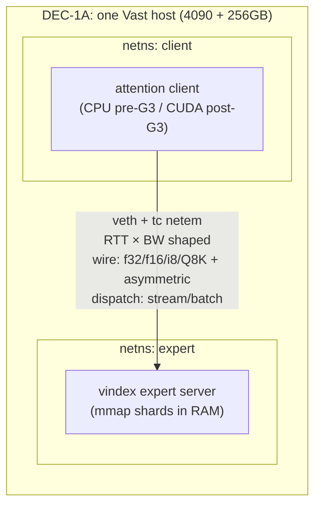
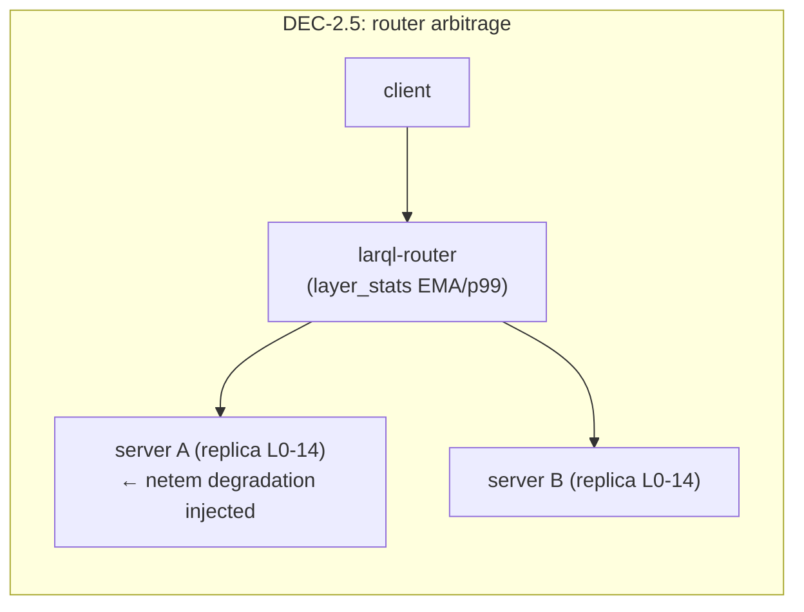

# DEC Funnel v0.5 — Decoupled Attention/Weights Serving at Batch and at Frontier Scale

**Programme:** DEC-0 … DEC-7 + G-ladder (GPU engineering) + C-ladder (CPU kernels) + M-ladder (MTP/speculative decode)
**Estate:** larql (grid stack, wire codecs, router, bench infra) · chuk-mcp-training (rig) · chuk-experiments-server (registry) · Cloudflare R2 (shards) · Vast/Colab (compute)
**Status:** v0.5 — **DEC-0 is CLOSED**; **DEC-1A is fully tooled as of 2026-07-24** (wire consolidation + two-scoreboard timing schema + asymmetric direction codecs + `dec-bench drift` C6 gate — protocol spec in [ADR-0025](adr/0025-wire-direction-and-timing-extensions.md); G0 decided in [ADR-0024](adr/0024-cuda-backend-g0-decision.md)) (both arms measured on the 26B; C1 holds on the dense AND routed-expert paths; registry `dec0-loopback-mac` completed — see §3 DEC-0 Result notes). v0.5 restructures DEC-1 into **1A** (transport decomposition, fitted latency model) + **1B** (compiled transport policy as a vindex artifact); reframes DEC-2's deliverable as the **multi-SLO N-at-SLO capacity table**; adds **DEC-CV** (composition validation), the **M-ladder** (MTP/speculative decode, accepted-token metrics), asymmetric direction codecs, and the two-scoreboard timing schema. v0.4 archived alongside as [`dec-funnel-v0.4.md`](dec-funnel-v0.4.md) (itself carrying the archived v0.2).
**Date:** 2026-07-24

---

## 1. Thesis & objective

The claim under test is **not** host offload for MoE. It is the decoupling of the transformer along its stateful/stateless boundary:

- **Attention** is the stateful half — KV/continuation state, per-user session, sequence position, latency budget. It stays GPU-side and sizes the GPU fleet.
- **The FFN/expert contribution** is a stateless pure function of the residual. Stateless pure functions become shared, durable, horizontally-scaled service tiers — with sharing, replication, versioning, hot-swap, and independent scaling inherited from the cut, not bolted on.

Direction of movement is the category difference: offload moves **weights to the compute** (GB across PCIe, one box, no sharing); this architecture moves **compute to the weights** (KB of activations across a negotiated wire, N clients, durable tier).

Consequently the interconnect is not a deployment constraint to survive — it is **the resource the architecture schedules**, and larql already engineers it three layers deep: wire codec ladder (f32/f16/i8/Q8K, per-request negotiated), dispatch batching (streaming 0.6 → batch 6.5 tok/s on 31B dense remote-FFN), and latency-EMA/p99 per-layer routing (`HeartbeatMsg.layer_stats` → larql-router steers replicated layers to the fastest server).

**DEC's job:** characterise the scheduler's operating envelope — the feasible region in (RTT × bandwidth × batch × wire format × dispatch mode) — and demonstrate the two artifacts no offload or AFD lineage can produce: a **shared multi-client knowledge tier** and **adaptive routing under degraded links**; then land both at frontier scale on Inkling.

Stated as theory rather than demo: the programme is building a **measurable account of how stateful attention consumes shared, stateless neural knowledge under latency, bandwidth, and quality constraints** — with three amortisation widths (clients × batch × tokens-per-step) packing work into each boundary crossing, and an explicit composed model under test:

`T_step(N) = T_queue(N) + T_codec + T_network + T_serve(B_effective)`

DEC-1A identifies the codec and network terms (single client, controlled link); DEC-2 identifies queueing and amortisation over client count (real, verified link); DEC-3 prices sparsity and speculative width; DEC-CV tests that the decomposition composes. Identifiability at every stage — no factorial entanglement.

Everything is pure inference — exact function, relocated weights. The walk/sparse-fidelity research track (E4) is out of scope.

### Cross-cutting metric: movement ratio

`dec/movement_ratio` = bytes crossing the attention↔weights boundary per token ÷ expert/FFN weight bytes touched per token. Offload ≈ 1.0 by construction; this architecture targets 10⁻³–10⁻⁴. Reported on every run; it is the one number that makes the categorical difference legible. **Measured at DEC-0: 1.2–1.9 × 10⁻³ (dense path), 5.2–8.2 × 10⁻⁴ (routed-expert path).**

### Standing rules — numbers that don't travel

**R0 — Every ratio ships with its convention named.** R1–R11 are all special cases. A measured number carries a hidden condition — the corpus it was scored on, the activation fraction it was measured at, the component it was divided by, the bytes it assumed present, the units it was expressed in, the execution it presumed. State the condition *with* the number, every time, or the next person to reuse it (including you, next week) reuses it somewhere the condition doesn't hold.

**Seven instances of one failure shape in a single week**, each a measured, correct number reused where its hidden condition didn't hold — and every one caught by arithmetic before any compute was spent on it. They are cheap to check and expensive to miss, so they are rules rather than anecdotes. Read this section before quoting any number in it.

**R1 — A bits/char figure must state its byte range, and both sides of a comparison must use the same one.** From [`k3-funnel.md`](k3-funnel.md) §4.7.7: §4.7.6 read a 2.5× engine disagreement that was entirely a corpus artifact — larql on boilerplate against a reference on prose. A corpus slice is a fixture; `--bytes 384` on a Gutenberg file cannot distinguish "the model is good" from "the text is boilerplate."

**R2 — Never transfer an expert-union or amortisation number across activation fractions.** From `dec8-5-k3-batch-union`: DEC-0 measured `experts_union_frac` = 0.1386 at batch 64, i.e. ~7.2× amortisation. That is a **6.25%-activation** number (8-of-128). K3 activates **1.79%** (16-of-896) and gets **3.0×** at the same batch, because sparser routing means unions overlap less. Union amortisation is `B·k / E·(1-(1-k/E)^B)` — it depends on `k/E`, not on batch alone. Quote the activation fraction with the ratio, always.

*The shape R1 and R2 share:* a number that is real, measured, and silently conditioned on something that doesn't come with it. When reusing a measured ratio in a new setting, name the condition it was measured under before the ratio itself.

**R3 — Divide bandwidth by the whole read, not the interesting part of it.** From `dec8-6-slice-touch-ledger`: K3's always-on dense weights are 29.86 GB/token against the routed experts' 25.83 — the *larger* half. A ceiling computed from the routed term alone reads 14.2 tok/s; the real figure is 6.6. If a component is named in the prose it belongs in the denominator.

**R4 — Zero-out ceiling. Before testing a lever, set the bytes it targets to zero.** If the *untouched* bytes still violate the target budget, that lever cannot decide the target, and any experiment scoped to it is answering a question that has already been closed. One line, run before the experiment is designed.

R4 convicts a whole week of this ladder retrospectively. Zero K3's routed expert bytes entirely and the dense half still reads 29.86 GB/token, which at 367 GB/s caps decode at 12.3 tok/s. Therefore:

- row sparsity could never have decided 20 tok/s on the slice (`dec8-1`, bars withdrawn),
- nor could perfect expert compression of any kind,
- and the 63× lever stack that opened the whole investigation dies in a single line — its five levers all targeted bytes that were never the binding half.

Run R4 first. It is free, and it is the difference between a month of fidelity work and one division.

**R5 — Work-width / commit-width separation.** Costs are set by every position *evaluated*; throughput is set by positions *committed*. Never use accepted length as verification width unless acceptance is perfect. A drafter proposing `T` positions of which `A` commit makes the target read the routed union across all `T` and bank only `A` tokens — so the condition is `D + ρ_r·R·u(T) ≤ η·B₂₀·A(T)`, with `T`, `A(T)` and `u(T)` three independent quantities. `T` is a design knob, not a drafter property: `u(T)` grows near-linearly at K3's sparsity while `A(T)` saturates, so the tolerable routed retention `ρ_max(T)` has an interior optimum (measured: T=3 at η=1.0, T=5 at η=0.80). A drafter's shipped width is not its best width.

DEC-9.2's pre-registration was withdrawn twice under these rules — once for scaling a routed-zeroed constant (R4/R0), once for using one variable as both union index and amortisation divisor (R5). Both before any compute.

**R6 — Logical / physical reuse separation.** A union, batch or block-width ratio is only *potential* reuse. Report the physical tensor loads that realise it; never substitute logical uniqueness for bytes actually read. Two claims that do not follow from measuring a union: **expert union does not imply grouped expert loading**, and **block width does not imply one dense-weight read**. Define `d(T)` = actual dense bytes read ÷ `D` and `r(T)` = actual routed bytes read ÷ `ρ_r·R`. Ideal execution gives `d=1, r=u(T)`; a naive token loop gives `d≈T, r≈T`. §DEC-2 already flags the routed server as streaming experts per row, with the measured union recorded as *unrealised scheduler headroom pending expert grouping* — so this is a known gap, not a hypothetical one.

**Keep `d`/`r` out of `η`.** `d(T)`, `r(T)` are how many bytes were *touched*; `η_D(T)`, `η_R(T)` are how efficiently those bytes were *served*. A repeated tensor load is work amplification, not poor dequantisation. Collapsing both into one scalar lets them trade off invisibly — which is R0's failure mode with two dials instead of one.

**R7 — Container-normalised efficiency.** Kernel η is meaningful only within a fixed storage representation and byte convention. Never compare η across containers as performance; compare elapsed time or `bpw/η`. Measured 2026-08-01 at K3's expert shape `[3584, 3072]` × 16 grouped experts: Q6_K reaches **η 0.89** and MXFP4 arm D only **0.724**, yet D is **1.31× faster** — `6.5625/0.89 = 7.374` against `4.0625/0.724 = 5.611`. A denser container is *easier* to make bandwidth-bound, so it reports a flattering η for the same wall-clock work. Ceiling probes decomposed arm D as skeleton 76% / fp4 decode 22% / X gather 2%, with the skeleton streaming at η 0.947–0.965 — so the low η was the price of the container, not a kernel defect, and there was no deficiency to fix. R7 is distinct from R6: R6 is logical-vs-physical reuse (`u(T)` vs `d(T)`/`r(T)`), R7 is that the *denominator's representation* changed.

**R8 — Disagreement-point oracle.** Validate an implementation at an input where the competing hypotheses produce **different** values. An oracle exercised only at an equivalence point cannot distinguish the intended implementation from a plausible wrong one, and will pass while the code is broken. Instances: slot 0 of an expert bank, where every offset convention yields zero (the K2 tournament read slots 1–15 from the wrong table and a slot-0 oracle passed); CN-10's rank-1 first answer token, which made "top-1 from L7" appear on every prompt; shared-vs-per-slot input, which only diverges from slot 1; a square `A_log` fixture, where per-head and per-channel readings coincide on the diagonal. The rule generalises: pick the probe point *after* enumerating the plausible wrong implementations, not before.

**R9 — A null is not a prediction.** A closed-form baseline says what a *structureless* process would do. It is the thing measurement is read *against*, never a substitute for measuring. The uniform-routing union law `U(t) = E(1-(1-k/E)^{tk})` was used to argue that a 512-token prompt touches essentially every expert, and therefore that prompt-conditioned selection narrows nothing. Measured on the DEC-0 routed pool (2026-08-01, `larql k3-ledger freq-mass`): the same law **overstates per-session support 3.4× at 16 steps** (38.1 of 128 measured against 128.0 predicted) and, in the other direction, **understates top-C coverage ~6.8×** — a 6.25% resident set covers 42% of routing events, not 6.25%. One assumption, errors in both directions, and DEC-8.6's "~1 of 16 hit/layer under uniform routing" inherited the second. Uniform understates coverage under *any* skew, so that error's sign travels even where R2 forbids its magnitude.

**R10 — A caveat has a sign, and the sign is per-statistic.** Attaching a corpus or capture caveat once, at the top of a run, applies it with the wrong sign to half the outputs. The DEC-0 pool is 64 unrelated single-turn prompts — a domain **mixture** — and that fact cuts opposite ways on the same run: for the **coverage curve** it is *anti-conservative* (a mixture is the anti-case for domain locality, so a domain-specific slice would beat the measured numbers), while for the **unobserved-expert count and participation ratio** it is *conservative* (a domain-selective layer would show a *wide* union across unrelated prompts, so measuring a narrow one anyway is stronger evidence, not weaker). State the sign with each statistic, not once with the capture. A related instance, extending R7's principle from storage representation to sample size: a top-*k* concentration statistic at fixed `k` is confounded by support size — `corr(unobserved, top-8 coverage)` reads **+0.861** across layers, but the shape-only forms (top-10%-of-support, normalised participation ratio, Gini) read **+0.543 / −0.501 / +0.659**. Roughly half the headline was measuring what it was conditioned on.

**R11 — A structural reduction is a claim about a KERNEL, not about a matrix. Price it on the kernel that will actually run it.** Fewer rows, fewer bytes, more reuse: none are savings until a kernel realises them. Two instances a day apart. `dec8-8`: `T` sequential matvecs gave **zero** weight reuse (`d(T)=r(T)=T`, textbook 1/T), so DEC-9.2's arithmetic rested on reuse the kernels do not provide. R4 zero-out ([`diagnoses/walk-ffn-r4-zeroout.md`](diagnoses/walk-ffn-r4-zeroout.md)): with routing supplied **free**, the sparse path captured only **23–40%** of its row-count reduction and at K=4096 still lost to dense — selection was never the binding limiter. Diagnostic signature: R4's capture fraction *rose* with retained width (23→34→40% against ceilings 5.00/2.50/1.67×), which means fixed per-row kernel overhead rather than row choice; a monotone capture column turns a data point into a mechanism. Useful framing is **"missing primitive, not refutation"** — the reduction is real but unrealisable by the current kernel, pointing at a different execution model rather than a dead idea. R4 quantifies it: merely *tying* dense needs ~18.6% execution improvement with routing already free, far past what tuning one gather recovers. **Corollary — realisability is a property of layout, not of the mask.** A per-channel mask saves nothing in output-major storage (strided within rows) yet is already a contiguous slab in input-major storage; and channel order is free, since `z'=Pz`, `W'=W·Pᵀ` leaves the model exactly unchanged. Never call a reduction unrealisable without naming the layout it was priced against. See [`diagnoses/moe-latent-axis-sparsity.md`](diagnoses/moe-latent-axis-sparsity.md).

### Three conventions this ladder now fixes

**Routed retention `ρ_r` is not 1.87.** That figure is DEC-8.6's R4 zero-out ratio (`total/dense`), never a routed-side result — it wore the wrong hat for two rungs. The banked routed-side floor is DEC-8.0's equal-thirds measurement: `w1`/`w2`/`w3` are 5,849,088 bytes each, so folding `w3` to per-feature scalars leaves **ρ_r ≤ 0.667** (a 1.5× routed reduction). Everything below that is row sparsity — parameterised as `row_factor`, **owner DEC-8.1, unset until it reports**. One banked number, one named unknown, no stipulations.

**Routing skew is measured, not assumed — and the adaptive-population arm is closed.** Instrument: `larql k3-ledger freq-mass --pool <capture>` (2026-08-01), reading the banked DEC-0 routed pool. It grades three bets from one already-captured artifact, and every number below is an **8-of-128, 6.25%-activation** figure on a 64-prompt domain mixture (R2, R10):

- **Static slice at K3's affordable size: insufficient.** A 6.25% resident set covers 42% of routing events; 90% needs 35% of the bank. Real skew, moderate — not the "5% of experts carry most of the routing" shape the slice arm assumed.
- **Session-adaptive population: refuted at the operating point.** Every arm scored on the same held-out half, with a shrinkage sweep `key = λ·pooled_LOO + (1−λ)·session_fit`. λ has an interior optimum at **0.75** at every cache size, but at C=8 the best realisable arm buys **1.03×** on the miss stream (0.5774 → 0.5595). The oracle bound is 1.41× and true locality is 0.130 (oracle − null), of which the best realisable estimator captures **14%**. The missing ingredient is predictive information, not a better λ. Hold pending a K3, long-session, domain-clustered trace.
- **Cold tail: promoted.** 620 of 3840 layer-expert pairs (16.1%) went unobserved in 8,192 events/layer — at least 20× below uniform by the rule of three, not a sampling artifact. `mass_per_residency` falls 8.27× → 6.76× → 3.28× across C=4/8/32, so there is no natural hot/cold cutoff and DEC-8.4 should allocate progressively rather than threshold globally.
- **Per-layer heterogeneity: static yes, adaptive no.** Unobserved experts per layer range **3 to 68 of 128**; effective bank (participation ratio) **14.8 to 50.5**. The same pool measured `causal − static` at −0.012 ± 0.015 with no layer winning. These are different axes and must not be summarised as "per-layer policies failed": a four-layer-class serving policy gets no support in its adaptive form and strong support in its static form. Read the narrow-bank layers as *a smaller bank used with ordinary evenness*, not router collapse — the shape-only concentration signal is moderate (see R10). **This is the number least likely to survive to K3**, since quantile balancing exists to flatten exactly it.

Conventions the instrument fixes: the export's `rank` is **pooled descending over the capture**, while the coverage curve's static arm is **leave-one-out per scored session**. A set built from the former and scored on the same capture is optimistic by **+0.000 to +0.006** mass, monotone in C, sign always positive — negligible at C=8 (+0.0026 on 0.425), so it is a correctness property to keep in the code and not a decision-relevant one at any size K3 can afford. The rule: *pooled mass proposes the serving image, held-out routing evaluates it.* An absent symbol means **unobserved in this capture**, never zero probability.

**Vision is excluded from the dense term `D`.** The DEC-8.6 ledger sums `language_model` layers plus text embeddings only; `vision_tower` and `mm_projector` are never counted. By residual against the 1.561 TB repo they are ~2 GB BF16, under 2% of `D` at 4-bit. Stated because an unnamed inclusion convention on the dense term is exactly where this ladder's arithmetic keeps finding its bodies — if a multimodal demo is ever in scope, `D` must be recomputed, not adjusted.

## 2. Claims under test

| ID | Claim | Falsifier |
|----|-------|-----------|
| C1 | ✅ **HELD (DEC-0, both paths)** — serving compute survives batched decode (gate/expert path at batch 64 within step budget) | step time super-linear in batch on loopback |
| C2 | The feasible region is large: at batch ≥16 with batch dispatch + f16 wire, LAN-class links (≤2ms, ≥2Gbps) reach ≥70% of loopback throughput | region collapses to loopback-only |
| C3 | One expert tier serves N clients near-linearly (≥80% linear at N=4) with tier headroom | saturation at N≤2 from tier compute/NIC |
| C4 | DRAM streaming amortisation for ultra-sparse MoE has a measurable batch-union bound (metrology; deliverable is the curve) | n/a |
| C5 | Inkling runs end-to-end decoupled: ≤48GB-VRAM attention client, experts in DRAM, ≥5 tok/s single-stream, shannon-verified | incoherent output or <1 tok/s |
| C6 | Wire codec ladder trades bandwidth for bounded fidelity: i8/Q8K paths stay within a pre-set bits/char drift vs f32 wire | drift exceeds gate on standard corpus |
| C7 | The latency-EMA router arbitrages heterogeneous links: traffic migrates off a degraded replica within a bounded window and recovers ≥90% of pre-degradation throughput | router fails to migrate or oscillates |
| C8 | K3 (2.8T, 16/896, MXFP4, KDA) runs decoupled as a **capability tier**: ≥3 tok/s single-stream from DRAM-resident experts, shannon-verified, with its batch ceiling pre-predicted by the DEC-3 boundary chart | incoherent output, <1 tok/s, or measured ceiling contradicting the DEC-3 prediction by >2× (instrument failure) |

Gate order: C1 ✅ → C2 → C3 sequential; C6 measured inside DEC-1A; C7 = DEC-2.5 after C3; C4 independent (first real-routing data point already measured at DEC-0 — see the routed Result note); C5 gated on C1+C2 **and** G3 (CUDA correctness); C8 gated on C5 (Inkling proven first) + DEC-3 re-parameterised on K3's real routing statistics.

## 3. Experiment ladder

### DEC-0 — Loopback batch curve, dual-arm (£0) — **CLOSED (arm M); arm L pending**

*Tests C1.*

- **Arm M (reference):** M3 Max, Metal attention + local expert server over loopback — anchors against known numbers (26B A4B: local 18.9 / 1-shard grid 18.3 / 2-shard 17.3 tok/s; `LARQL_SKIP_MOE=1` ceiling 56.8 — canonical name as of 2026-07-22; the unprefixed `SKIP_MOE` the grid path historically read is now a loud deprecated alias, hardening item 9). **Anchor configuration note:** those numbers predate the KV append-in-place and spin-pool landings; DEC-0 re-baselines with the flag set recorded in the run record, and a first-run result *above* the anchor is expected, not an instrument error.
- **Arm L (Linux):** Colab high-RAM — T4 present but attention on **CPU until G-ladder lands**; expert server on same VM. Absolute tok/s is non-hero; the batch *shape* (sub-linearity of step time) is the claim-bearing measurement. Replays the host-portable arm-M pools. **Runs from prebuilt binaries as of `v0.1.0`** (ADR-0026): `scripts/dec0-arm-l.sh` fetches the Linux archive and *refuses* to `cargo build` on a GPU host, so the T4 allocation is never spent on compilation. Needs only the two pool URLs.
- **Method — two instruments, pre-registered (v0.4.2):** larql's decode loop is single-sequence (`--ffn-dispatch batch` batches *layer dispatches* within one token step, not sequences), so the batch axis is measured by the **residual-replay loadgen** (`larql dec-bench`): capture real pre-normed per-layer residuals from single-stream decode over 64 distinct prompts (`dec-bench capture`, prompts pinned in `bench/dec0/prompts.txt`; `--routing` additionally captures raw + pre-experts-normed planes and per-layer top-k routing for the routed arm), then replay them as B-row requests (`dec-bench replay`, `--endpoint walk-ffn|experts`), batch ∈ {1, 8, 16, 32, 64} × wire × dispatch {streaming, batch}, 3 repeats. Distinct prompts per row keep the MoE routing union realistic; replay is model-free, so Mac-captured pools run unchanged on the x86 arms. E2e tok/s remains the **single-stream anchor** via the existing `larql bench --ffn` path. Driver: `scripts/dec0-loopback.sh`.
- **Metrics:** `dec/tok_s`, `dec/step_ms_p50/p99`, per-layer stats from `HeartbeatMsg.layer_stats`, `dec/movement_ratio`, `sys/*`.
- **Pass:** step time sub-linear through batch 32 on both arms.
- **Kill:** serving compute saturates below batch 16 → profile before any spend.
- **Result — dense arm ran 2026-07-23 (registry `dec0-loopback-mac` / `RUN-20260722-231112-00437`, commit `021ab42f`): C1 PASSES on the dense/shared-expert path.** Batch-dispatch step p50 ×1.6–1.8 at B32 vs B1 (f32/f16/i8; B8 free at ×0.9–1.0, B16→B32 nearly flat); q8k B1 = 12.5 ms (fastest single-row arm) converging to the same absolute batch step times via the §1a batched-GEMM fix. Movement ratio measured 1.2–1.9 × 10⁻³ across wires. Aggregate tier throughput ~1,050 tok/s at B64/batch (~25× single-stream); streaming dispatch reaches only ×5.1–5.7 at B64 — the dispatch axis is load-bearing. Anchor re-baseline: remote-FFN streaming 27.8–28.6 tok/s (vs historical 18.3), warm local Metal MoE 23.6, split ~66% attention / 34% FFN round-trips; i8 genuinely served (`LARQL_I8_WIRE=1`, 285 KB/tok). Kill condition not approached. The 64-prompt residual pool is captured and host-portable (`bench/dec0/residuals-gemma4-26b-a4b-q4k`, local + registry artifacts 701/702) — arm L and DEC-1A replay from this exact pool.
- **Result — routed-experts arm ran 2026-07-23 (`RUN-20260723-223428-00439`, commit `64c9e0e0`): C1 COMPLETE on the full 26B.** Real captured routing replayed against `/v1/experts/multi-layer-batch[-q8k]`: step p50 ×23.6 at B32 (sub-linear; kill condition clear), tier ~178 tok/s flat from B16. Honest mechanism split is load-bearing: dense amortises by GEMM weight-sharing (×1.6), routed only by thread-fill + overhead (server streams experts per-row — pre-registered perf caveat), so the routed ceiling is a schedule property. **Batch-union bound measured from production routing: unique-expert bytes = 13.9% of naive at B64 (~7.2× grouped-scheduler headroom — more overlap than uniform-random predicts)**, upgrading DEC-3's curve with a real-routing point ahead of schedule; build the expert-grouped scheduler before quoting DEC-2 tier-capacity numbers. Movement ratio 5.2–8.2 × 10⁻⁴ routed. DEC-0 arm M is CLOSED in the registry (`dec0-loopback-mac` completed).

### DEC-0.5 — x86 expert-tier kernel gate (~$1)

The hot CPU path (Q4K inner dot) is hand-written **aarch64 NEON**, tuned on M3 Max; Linux/x86 falls back to the generic/OpenBLAS route (the serving path logs its kernel class at startup — no DEC number is ever recorded on an unlogged scalar fallback). Before any fleet-wide projection:

- **Method:** identical expert-server bench (per-layer expert/FFN latency, gate KNN, dequant-stream throughput) on the Mac vs one cheap Vast x86 EPYC box.
- **Gate:** x86 within 2× of Apple Silicon per-core → proceed, note the factor in all projections. Worse than 3× → **C-ladder (AVX-512/AMX Q4K inner dot) becomes a blocker for the fleet claim** (not for the demo — the demo can eat the factor) and gets scheduled before DEC-5's throughput arm.
- Rationale: every DEC-2/3/5 curve runs on x86 DRAM boxes; projecting from M3 numbers without this factor is the most likely way the 20× claim quietly becomes 6×.

### DEC-1A — Transport decomposition (netem, single box, ~$2–3)

*Tests C2 + C6. Replaces v0.2's two-arm design. Output is not just the map — it is the **fitted latency model** (the T_codec and T_network terms of the composed hypothesis) that DEC-2 and DEC-CV consume.*

- **Infra:** one Vast host, 4090 + ≥256GB RAM. Attention client and expert server in separate network namespaces; `tc netem` shapes the veth.
- **Sweep:** RTT ∈ {0.05, 0.2, 1, 5, 20ms} × bandwidth ∈ {1, 2.5, 10, 25, ∞ Gbps} × batch ∈ {1, 8, 16, 32, 64} × **wire ∈ {f32, f16, i8, Q8K, plus asymmetric pairs (in/return compressed independently: f16/i8, i8/f16)}** × **dispatch ∈ {streaming, batch}**. Prune with a coarse pass, densify around the knee. **Single client only** — client count is DEC-2's axis on a real link; crossing it into the shared netem host would confound network effects with CPU contention. The composed DEC-1×DEC-2 model predicts the joint surface; DEC-CV spot-checks validate the composition.
- **Timing decomposition (two-scoreboard schema):** every point records `queue_ms`, `encode_us`, `transmit_us`, `serve_us`, `return_us`, `client_decode_us` alongside step p50/p99 — tier efficiency (aggregate rows/s, bytes/row) and user latency (inter-token p50/p99) are reported as separate scoreboards, never collapsed into one tok/s figure.
- **Asymmetric pairs are a mechanistic probe, not just configs:** inbound residual (accumulated session state) and outbound FFN delta (local transformation contribution) need not share dynamic range, outlier structure, or quantisation sensitivity. Either asymmetric outcome — residual needs f16 while delta tolerates i8, or the reverse — is an interpretability result about where precision lives, and feeds DEC-1B.
- **Instrument:** the DEC-0 pair — `larql dec-bench replay` for the batch×wire surface (same Mac-captured pools; replay is model-free) + `larql bench --ffn URL` for the single-stream anchor + `make bench-wire` for codec throughput — run as a rig workload emitting the `dec/*` schema. Record `dec/payload_bytes_tok` per wire format. Note the i8 arm requires `LARQL_I8_WIRE=1` server-side (`served_wire` records fallbacks).
- **Model check:** the surface must reproduce the two known field points — ~25 tok/s LAN and 2–3 tok/s Fly.io London on 26B (30 crossings × RTT accounting). If it doesn't, the instrument is wrong, not the field data.
- **C6 gate:** i8/Q8K arms run `larql shannon verify`-style bits/char scoring vs the f32-wire baseline; drift gate pre-set at 0.5% (matching the repo's existing CI threshold).
- **Pass (C2):** as stated in claims table.
- **Deliverable:** Chart 2 — the feasibility map: for each (RTT, BW), max tok/s over wire×dispatch at batch 32, annotated with the colocation classes (loopback / rack / DC / metro) each configuration can inhabit — plus the fitted T_codec/T_network terms with error bands. This is the central chart of the programme.

### DEC-1B — Compiled transport policy (gate: DEC-1A flat-codec results, ~$2)

Per-layer sensitivity derived **empirically**, not hand-labelled from the zone map:

1. Quantise only layer *l*'s inbound path; measure local residual error, downstream recovery, KL, task effect. 2. Repeat for its outbound delta. 3. Estimate interaction effects for adjacent sensitive layers. 4. Compile the minimum-bytes policy satisfying the quality constraint: min_π Σ_l bytes(π_l) s.t. KL(P_π‖P_ref) ≤ ε plus top-1-agreement bounds.

- **Artifact:** the compiled per-layer schedule (e.g. `L0–11: r=i8,Δ=i8; L12: r=f16,Δ=i8; …`) ships **in the vindex manifest** — transport policy as a versioned, digested deployment artifact alongside the shards. Measurement compiled into runtime policy: the project's recurring pattern (residual-state → bounded continuation; localisation → patching; sensitivity → transport), now formalised.
- **Deliverable:** bytes saved at fixed quality bounds, flat vs compiled; the compiled row joins DEC-2's capacity table.

### DEC-2 — Shared knowledge tier (~$5)

*Tests C3. Unchanged pass criterion; upgraded framing: this is the experiment structurally impossible for offload — it has no N-client story at any price.*

- One expert server; N ∈ {1,2,3,4} attention clients (cheap Vast GPUs — CPU attention acceptable pre-G-ladder — + Colab + Mac BYO). Fixed batch at the DEC-1A knee. Aggregate tok/s vs N; tier CPU/mem-BW/NIC overlay; `dec/movement_ratio` per client.
- **Pass:** ≥80% linear at N=4 with tier headroom. **Kill:** saturation at N≤2.
- **Deliverable:** Chart 3 becomes the **N-at-SLO table** — clients served per tier at p99 inter-token SLO with **multiple SLO columns (25 / 50 / 100ms)** so a codec that merely rides a steep queueing curve is distinguishable from one that genuinely adds capacity — per wire policy (f32, f16, i8, asymmetric, and DEC-1B's compiled schedule), with quality delta and tier utilisation alongside, linearity curve as supporting evidence. This is the enterprise-legible unit: clients per box.
- **Capacity-number precondition (measured at DEC-0):** the routed tier currently streams expert weights per-row — unique-expert bytes are only 13.9% of naive traffic at B64 (~7.2× headroom). **Build the expert-grouped scheduler (group same-layer tasks by unique expert; skinny-GEMM per expert) before quoting tier-capacity numbers here**, or the table underestimates a grouped tier by most of an order of magnitude.
- **Client-side KV footprint is a capacity axis, not a speed one (priced at C0).** The client KV cache is `f32`, costing **480 KB per context-token per client** — ~1 GB per client at ctx 2048 on the 26B (30 layers × `kv_dim` 2048; the `sliding_window` 1024 caps 25 of 30 layers, so growth beyond the window is only the 5 global layers). Client *memory*, not tier bandwidth, may be what binds the N-at-SLO table first, so **record client KV bytes alongside tok/s at every N** — the same instrumentation K3 already wants (§3 DEC-6 compensating factor). Halving to f16 roughly doubles client density and buys 3–8% of a token in speed; C0 priced it as a **capacity** lever and explicitly *not* a long-context speed fix. See [`docs/diagnoses/memory-bandwidth-roofline.md`](diagnoses/memory-bandwidth-roofline.md).

### DEC-2.5 — Router arbitrage under degradation (~$2)

*Tests C7. The adaptive-grid demonstration; no offload/AFD lineage can draw this chart.*

- **Infra:** one client; a layer range replicated across two expert servers behind larql-router. (The expert endpoints now carry `RifGuard`/`requests_total`/per-layer latency — hardening item 13 — so the C7 router sees exactly the traffic DEC generates.)
- **Method:** steady state at fixed batch → netem-degrade server A (inject 10ms RTT, then throttle bandwidth) → observe `layer_stats` EMA/p99 and route-share migration → remove degradation → observe recovery. Repeat with degradation flapping to probe oscillation.
- **Pass:** ≥90% of pre-degradation throughput recovered within a bounded migration window; no sustained oscillation under flap.
- **Deliverable:** Chart 4 — route share + tok/s over time with degradation window shaded. Also the strongest 30 seconds of video B-roll in the programme.

### DEC-3 — Sparse batch-union metrology (~$2–4, independent, two passes)

*Tests C4 and pre-draws C8's ceiling. A first real-routing data point already exists: DEC-0's routed arm measured the Gemma-shaped union curve from captured production routing (13.9% unique at B64).*

- **Pass 1 (synthetic, any time):** synthetic experts on a big-RAM x86 box; top-16-of-896 (K3-shaped), top-6 (Inkling-shaped), top-8-of-128 (Gemma-shaped) under uniform and Zipf routing; effective GB/step and step time vs batch ∈ {1…256}. Anchor the Gemma-shaped synthetic arm against DEC-0's measured curve.
- **Pass 2 (K3-real, at weight drop):** re-parameterise with K3's **actual expert-selection distribution** — harvested from the published config + a routing-statistics run over a standard corpus as soon as weights land (2026-07-27 promised), even if DEC-6 itself waits. Upgrades the boundary chart from estimate to prediction; DEC-7's measured ceiling must land within 2× of it (C8's instrument-check clause).
- **Speculative width (M-ladder join):** k ∈ {1, 2, 4, 8} as a sweep axis with **acceptance rate carried on every point** — the reported units are *wire bytes per accepted token* and *latency per accepted token* (step cost ÷ E[accepted/step]), never raw k. A codec irrelevant at k=1 may matter at k=4 (fatter crossings); RTT matters less per accepted token (one crossing amortised over several outputs). Client count is **explicitly not** an axis here — clients stay in DEC-2 for identifiability; the three widths meet only in DEC-CV.
- **Deliverable:** Chart 5 — where DRAM amortisation dies per sparsity class, synthetic and K3-real overlaid, with k-panels; quoted proactively as the honest boundary of the claim.

### DEC-CV — Composition validation (~$2–3)

A deliberately **small** set of adverse joint points — shaped link × many clients × speculation — chosen where the composed model's predictions are most strained. Pass: measured T_step and N-at-SLO within stated error bands of the DEC-1A/1B/2/3 composition. Fail: the decomposition has an interaction term; find it, name it, add it to the model. Either outcome is a result — this stage is what licenses using the fitted model for **fleet sizing by calculation** instead of re-measuring every deployment.

### DEC-4 — Inkling extraction (~$5–10; gate: DEC-0 ✅ + DEC-1A passed)

- 2.5TB-NVMe unmetered Vast box; `larql extract` extended with the Inkling architecture (tml-renderer + config as reference); drop multimodal weights (text-only v1) **preserving MTP head tensors (M0)**; Q4K experts; `larql slice --preset client` / `expert-server`; `larql publish` → R2 mirror.
- **Verification gate:** `larql shannon verify` against the HF reference on a fixed corpus, ≤0.5% bits/char — the repo's existing cross-engine harness is the logit-match gate, no new verifier needed.
- **Kill:** time-boxed effort wall on architecture quirks → park, ship Gemma-scale results, revisit.
- **Artifacts:** Inkling vindex (full + client + expert-server slices) in R2 — the reusable asset independent of the video.

### DEC-5 — Inkling live demo (~$8–14; gate: DEC-4 verified **and** G3 passed)

- **Primary arm — single fat host:** one Vast box, 48GB card + 512GB–1TB RAM; experts in host DRAM, zero network. Best tok/s, least filming risk. Expected 5–15 tok/s single-stream (41B active ≈ ~20GB/token Q4 vs 200–400GB/s real-world DRAM BW, minus dequant/orchestration).
- **Secondary arm — networked tier:** 2-box expert split via `--moe-shards`, same DC, for the distributed frame and a small-N shared-tier point at 975B.
- **Pass (C5):** ≥5 tok/s sustained, coherent, shannon-verified extraction. Stretch ≥10.
- **Deliverable:** the frame — `nvidia-smi` (one modest card) · `htop` (hundreds of GB resident) · live stream — plus the movement-ratio line: "~20GB of weights participated in that token; kilobytes moved."

### DEC-6 — K3 extraction + KDA client port (gate: DEC-5 passed; weights published)

> **Model-side work is now specified separately.** [`k3-funnel.md`](k3-funnel.md) restructures everything below into a three-rung adapter ladder — R1 GPT-OSS-20B (expert/format pipeline), R2 Kimi Linear 48B-A3B (the KDA stack, against a *local* reference implementation), R3 K3 as a delta — with its own phases, gates, and registry programme `k3`. DEC-6's claims, gates, infra line and kill condition are unchanged; only the execution order is. Read that document for what gets built; this section for what DEC requires of it.

The serving topology transfers wholesale from Inkling; what's new is model-side:

- **6a — expert path (moderate, partly solved):** MXFP4 expert extraction reuses the GPT-OSS-120B lineage (128-expert MXFP4 already in the support table); 896 experts is a bigger bank for existing range-sharding. New: MXFP4 dequant-or-native decision on the x86 tier (AMX speaks INT8/BF16 — dequant pass in the streaming loop vs a native FP4 gather kernel; benchmark both, pick per DEC-0.5 methodology). Compute-side, MXFP4 lands as one `QuantFormat` variant + one `FormatRoute` arm (the side-metadata/E8M0 template is `ternary_matvec` — see `larql-compute/src/quant_route.rs`).
- **6b — KDA attention client (the real port):** Kimi Delta Attention is hybrid linear attention, not vanilla SDPA — new attention math in the client slice, plus faithful Stable LatentMoE routing (latent-space routing, quantile balancing) for router-side expert selection. This is to K3 what the whole extractor was to Inkling: expect 3–6 weekends. `shannon verify` ≤0.5% bits/char against the reference implementation is the gate, unchanged.
- **Compensating factor to measure:** KDA's design goal is cheap decode state at long context → *lower* KV pressure on the client GPU. K3 is harder on the expert tier and kinder on the attention tier; record client-side KV bytes/token alongside the usual schema.
- **Infra:** extraction box upgraded to ≥3TB NVMe; ~1.4TB native download.
- **Kill:** KDA port exceeds its time-box → park with Inkling shipped; the programme's claims stand without K3.

### DEC-7 — K3 live: the capability-tier demo (gate: DEC-6 verified)

- **Infra:** one or two 1.5–2TB-DRAM hosts (single fat host preferred, per DEC-5 lesson) + the DEC-5 attention client class.
- **Positioning (pre-registered, load-bearing):** K3-decoupled is a **single-digit-batch capability tier** — hard queries, interactive agent sessions — *not* a throughput tier. The batch-union bound from DEC-3 pass 2 is quoted up front; DEC-7 measures against it (C8's 2× instrument clause).
- **Pass:** ≥3 tok/s single-stream sustained, coherent, shannon-verified; measured batch ceiling within 2× of the DEC-3 prediction.
- **Narrative:** the escalation act — largest open model ever (2.8T) on the same architecture, *with its honest limit measured and stated* — the chart that separates a research programme from a stunt.

## 4. G-ladder — GPU engineering (CUDA attention client)

larql's GPU path is Metal-only today; on Linux the attention client falls back to CPU. The hero demo and any NVIDIA fleet claim need a CUDA attention path. Scoped as its own gated ladder, off DEC's critical path for everything except DEC-5. The plumbing side is done: `larql-compute`'s backend factory (`backend_from_spec` + `BackendKind`, ADR-019 ctor injection) means `larql-compute-cuda` plugs in by registering one constructor — no CLI or trait edits.

- **G0 — backend decision (time-boxed).** CUDA-native (cudarc/PTX, Metal shaders as the reference implementation, maximum kernel control) vs wgpu/Vulkan (portability, one shader dialect for Metal+Vulkan+CUDA-via-Vulkan, likely perf tax on Q4K inner loops). Default recommendation: CUDA-native for the bounded client-slice kernel set; revisit wgpu when portability matters more than the hero number.
- **G1 — quantised GEMV/GEMM:** Q4K/Q6K matvec + matmul kernels (QKV/O projections, LM head). The MSL shaders (`q4k_matvec`, defused norm+QKV per ADR-016) define the semantics to port.
- **G2 — attention path:** RMSNorm, RoPE, SDPA with KV cache through the `KvEngine` trait, GEGLU (client-side dense layers where present). Client slice only — no expert kernels needed for DEC-5's primary arm.
- **G3 — correctness gate:** `larql shannon verify` on the CUDA path vs HF/PyTorch, ≤0.5% bits/char, wired into the existing shannon-verify CI workflow. **DEC-5 hero is gated on G3**, not on G-ladder completion.
- **G4 (post-DEC-5, optional):** `cuda-experts` — GPU-backed expert servers, mirroring `metal-experts` (with its known build-separation constraint: server binary only).

**Interim validity note:** DEC-0…2.5 curves are claim-bearing with CPU attention — they characterise the expert tier, the wire, and the router, and the crossing-tax accounting is attention-implementation-independent. Only absolute end-to-end tok/s waits on G3, and only DEC-5 headline numbers require it.

## 5. C-ladder — x86 CPU kernels (conditional)

Triggered by DEC-0.5: AVX-512/AMX Q4K inner dot for the x86 expert tier, acceptance = closing to ≤2× Apple Silicon per-core on the expert-server bench. Blocker for fleet-cost projections if DEC-0.5 shows >3×; never a blocker for the demo.

**C0 — bandwidth roofline (measured 2026-07-29, registry `c0-bandwidth-roofline`).** Run before spending on kernels, and it revises the premise of this ladder. On Apple Silicon the **CPU core complex attains 127 GB/s read against the GPU's 367** (SoC spec 400) — 31% vs 92% of the chip, a **2.9× structural gap that is fabric ports, not software**. Against that denominator the production CPU matvec already achieves **50–91%**, so aarch64 CPU byte-movement is essentially finished; the long-quoted "~47 GB/s effective" came from a bench arm that hand-rolls its own parallelism and stopped describing the shipping path when the spin pool became default. Two consequences for this funnel: (1) **the G-ladder's case is now quantitative** — byte-limited decode belongs on the GPU because of a measured 2.9×, not because of "CUDA parity"; (2) **C-ladder acceptance should be judged against x86's own attainable ceiling**, measured with the same probe (`cargo run --release -p larql-compute --example membw_probe`), rather than against Apple Silicon per-core — a ≤2× per-core gap means something different if the two chips' attainable ceilings differ. Measure the x86 ceiling as part of DEC-0.5 while that box is up; it is a two-minute probe. Full writeup [`docs/diagnoses/memory-bandwidth-roofline.md`](diagnoses/memory-bandwidth-roofline.md).

## 5b. M-ladder — MTP / speculative decode

Hosted Inkling serves ~63–73 tok/s; vLLM's stack reaches up to ~380/user via MTP. The DRAM rig closes most of the felt gap the same way — and MTP is architecture-friendly here: verifying k draft tokens is a batch-of-k step through the existing batch-dispatch path, so **crossing tax per token divides by tokens-per-step**, widening the DEC-1A feasibility surface (WAN-class topologies gain the most).

- **M0 (NOW, inside DEC-4/6):** extractors preserve MTP head tensors — explicitly excluded from the "drop multimodal" rule; MTP head ships in the `client` slice (attention-tier scale, stateful side of the cut).
- **M1 — model-agnostic verify loop (pre-weights, on Gemma):** draft-verify with prompt-lookup/n-gram drafting, greedy acceptance first (exact-match; shannon-verify story preserved), rejection sampling later. KV rollback via the derivative-state engines — canonical residual stream makes rollback a truncate; `standard` gets a KV-length truncate. Metrics: `dec/accept_rate`, `dec/tokens_per_step`.
- **M2 — Inkling MTP head on the rig (post-DEC-5):** real head replaces the n-gram draft. Target: 10 → 25–40 tok/s single-stream on the fat-host arm at zero additional tier bandwidth per token.
- **Tier cost note:** effective batch for expert-union purposes is B×(k+1); speculative width k joins the DEC-3 sweep axes so the boundary chart prices it.

## 6. Infrastructure specification & topology

Control plane unchanged from v0.2 (Fly MCP dispatch + registry + R2; budget hard-walls; single-use cj_ tokens; Mac BYO-only). Workload units: `vindex-server`, `attention-client`, `netem-harness` (namespace + tc setup + sweep driver), each agent-launchable with pulse metrics.

| Stage | Node role | Count | GPU | RAM | Disk | NIC | Rental |
|---|---|---|---|---|---|---|---|
| DEC-0 M | Mac (BYO) | 1 | Metal | 128GB | — | — | — |
| DEC-0 L | Colab combined | 1 | T4 (idle pre-G3) | high-RAM | default | — | Colab |
| DEC-0.5 | x86 bench box | 1 | cheapest attached | ≥128GB | 50GB | — | interruptible |
| DEC-1A | netem host | 1 | 4090 | ≥256GB | 100GB | n/a (namespaces) | interruptible |
| DEC-2 | expert server | 1 | cheapest | ≥64GB | 50GB | 10Gbps | on-demand |
| DEC-2 | clients | 4 | 3060/4090 mix + Mac + Colab | ≥16GB | 30GB | 1Gbps | interruptible |
| DEC-2.5 | router + 2 servers + client | 4 | cheapest | ≥64GB ea | 50GB | 10Gbps | on-demand |
| DEC-3 | metrology box | 1 | cheapest | ≥384GB | 50GB | — | interruptible |
| DEC-4 | extraction box | 1 | ≥24GB | ≥128GB | ≥2.5TB NVMe | unmetered fat downlink | on-demand |
| DEC-5 primary | fat host | 1 | 48GB (A6000/L40S) | 512GB–1TB | 250GB | — | on-demand, rel ≥0.95 |
| DEC-5 secondary | expert boxes | 2 | cheapest | 512GB ea | 250GB | 10Gbps | on-demand, rel ≥0.95 |
| DEC-6 | extraction box | 1 | ≥24GB | ≥256GB | **≥3TB NVMe** | unmetered fat downlink | on-demand |
| DEC-7 | fat host | 1–2 | 48GB (client) + cheapest (tier) | 1.5–2TB total | 500GB | 10Gbps if split | on-demand, rel ≥0.95 |

**Host provisioning rule (ADR-0026, in force since `v0.1.0` / 2026-07-25):** every stage above runs on a rented, single-use box, and none of them build larql from source on a GPU-provisioned host — the drivers fetch the tagged release archive via `scripts/lib/larql-binaries.sh`. A missing artifact for a platform is a **blocker on the dispatch**, not something to work around by building on the box; the helper exits non-zero rather than burning the allocation on a 20–40 minute CPU-only compile. The sole exemption is DEC-0.5's criterion kernel bench, which must compile because it *is* the measurement.

Procurement filters and the iperf3 network-verification gate carry over from v0.2 verbatim in substance (measured `net/gbps`/`net/rtt_ms` in the run record; **fail = re-provision, never re-interpret**; single-host netem stages exempt — the shaping is the instrument). Stage topology diagrams carry over with two changes: DEC-1A is the single-host netem namespace pair, and DEC-5 leads with the single-host arm.

## 7. Registry & artifact conventions

Registry experiments: `dec0-loopback-{mac,colab}` (mac **completed** — 2 runs, conclusion recorded), `dec0p5-x86-kernel-gate`, `dec1-feasibility-surface` (1A and 1B land as tagged runs), `dec2-sharedtier`, `dec2p5-router-arbitrage`, `dec3-sparseunion` (pass 2 lands as a run tagged `k3-real`), `dec-cv-composition`, `dec4-inkling-extract`, `dec5-inkling-live`, `dec6-k3-extract`, `dec7-k3-live`, plus `g3-cuda-shannon`. Experiments server is system of record; harness mirrors; charts + shannon reports + surface data as registry artifacts; shard sets pinned in R2. Metric schema: `dec/movement_ratio`, `dec/payload_bytes_tok`, `dec/wire_format`, `dec/dispatch_mode`, `dec/endpoint(_code)`, `dec/weight_bytes_tok_{naive,union}`, `dec/experts_union_frac`, `dec/accept_rate`, `dec/tokens_per_step` (M-ladder), the two-scoreboard timing fields (`queue_ms`, `encode_us`, `transmit_us`, `serve_us`, `return_us`, `client_decode_us` — DEC-1A), `net/gbps`, `net/rtt_ms`, `client_rayon_threads`, per-layer p50/p99 via `layer_stats`.

## 8. Budget

| Stage | Est. spend |
|-------|-----------|
| DEC-0 (both arms) | £0 (arm M spent) |
| DEC-0.5 | ~$1 |
| DEC-1A | ~$2–3 |
| DEC-1B | ~$2 |
| DEC-2 | ~$4–5 |
| DEC-2.5 | ~$2 |
| DEC-3 | ~$2 |
| DEC-CV | ~$2–3 |
| DEC-4 | ~$5–8 |
| DEC-5 | ~$8–14 |
| DEC-6 | ~$10–15 (download-dominated) |
| DEC-7 | ~$10–20 (2TB-host premium) |
| G-ladder dev GPU time (4090 sessions) | ~$10–20 |
| **Total (through DEC-5)** | **≈ $40–60** |
| **Total (through DEC-7)** | **≈ $60–95** one-off |

Recurring: R2 rises to ~$25–30/month with the K3 shard set (~1.4TB) alongside Inkling's (zero egress on both). Rates per v0.2 §7; ±30%.

## 9. Risks (pre-registered)

- **CUDA port slippage (G-ladder)** — mitigated: only DEC-5 headline gated on G3; all Gemma-scale content and every curve except hero tok/s proceeds on CPU attention; Metal shaders + shannon-verify CI bound the port's scope and acceptance.
- **x86 kernel gap (DEC-0.5)** — the most likely silent deflator of the fleet claim; measured first, factored into every projection, C-ladder on standby.
- **Wire fidelity (C6)** — i8/Q8K bandwidth wins are conditional on the 0.5% bits/char gate; a failed gate removes those arms from the feasibility map, it does not sink the map.
- **Per-row expert streaming (measured, DEC-0)** — the routed tier's capacity numbers are a schedule property until the expert-grouped scheduler lands (~7.2× byte headroom at B64 measured from real routing); DEC-2 quotes no tier-capacity number before it.
- **Extractor is real work** — new-architecture code against a week-old model; time-boxed; shannon verify is the tripwire.
- **Released precision may be BF16 (~2TB)** — budget NVMe + hours; quantise at extraction.
- **Marketplace networking** — iperf3 gate retained; netem consolidation means no claim-bearing curve depends on marketplace link quality.
- **Router oscillation under flap (DEC-2.5)** — if observed, damping is an engineering fix in larql-router, and the experiment has done its job; pre-registering it as a possible finding, not a failure.
- **KDA port complexity (DEC-6b)** — hybrid linear attention + LatentMoE routing is the largest single unknown in the programme after G-ladder; time-boxed, gated behind a shipped Inkling result, and the programme's claims stand if it parks.
- **K3 positioning discipline (DEC-7)** — the capability-tier framing (single-digit batch) is pre-registered *before* results exist so a modest batch ceiling reads as the predicted boundary, not a walk-back; DEC-3 pass 2 must publish before DEC-7 runs.
- **MXFP4 on x86** — dequant-in-loop vs native FP4 gather is an unmeasured 1.5–2× on the K3 tier; benchmarked inside DEC-6a before any DEC-7 projection.
- **Batch-union limit (C4)** — quoted proactively as the boundary of the claim for ultra-sparse MoE at high batch; first real-routing point measured at DEC-0.
- **Speculation acceptance (M-ladder)** — all speculative-width wins are conditional on measured `dec/accept_rate`; reporting is per *accepted* token so a low-acceptance draft cannot inflate a headline.

## 10. Sequencing

**DEC-0 arm M: done** (dense + routed, C1 closed, anchors re-baselined). Next: DEC-0 arm L + DEC-0.5 same session (pools are host-portable; ship both to R2 first) → DEC-1A surface (the central experiment) → DEC-1B → DEC-2 (expert-grouped scheduler built first if tier-capacity numbers are to be quoted) → DEC-2.5 → DEC-3 pass 1 any idle evening → DEC-CV. G0–G3 in parallel from week 1 (the long pole); M1 on Gemma any time. **At weight drop (promised 2026-07-27): immediately harvest both models' configs and K3's routing statistics** — DEC-3 pass 2 costs pennies and converts the boundary chart into a prediction while DEC-6 waits. DEC-4 → DEC-5 while Inkling is news; DEC-6/7 as the escalation act, gated on a shipped DEC-5 and a passed KDA time-box.
